# DailyBrief Authentication Flow

```mermaid
graph TD
    subgraph "Client"
        User[User]
        Browser[Browser]
    end
    
    subgraph "Frontend Next.js"
        AuthPage["/auth Page"]
        NextAuth[NextAuth.js]
        PrismaAdapter["Prisma Adapter<br/>User DB"]
        ClientState["Client State<br/>(JWT token)"]
        NextMiddleware["Next.js Middleware<br/>(Route Protection)"]
        APIClient["API Client<br/>(with Auth Headers)"]
        LoadingCheck["/loading-check Page"]
        Home["/home Page"]
        Onboarding["/onboarding Page"]
    end
    
    subgraph "Auth Providers"
        GoogleOAuth["Google OAuth"]
        AppleOAuth["Apple OAuth"]
        MagicLink["Email Magic Link<br/>(Resend)"]
    end
    
    subgraph "Backend Django"
        DjangoAuth["Django Auth System"]
        AuthMiddleware["Auth Middleware<br/>(Token Validation)"]
        UserAPI["User Sync API"]
        PreferencesStatusAPI["Preferences Status API"]
        RestAPI["REST API<br/>(Protected Endpoints)"]
        DjangoUser["Django User Model<br/>(PostgreSQL)"]
    end
    
    %% User interactions
    User -->|"Visits"| Browser
    Browser -->|"Loads"| AuthPage
    
    %% Auth flow
    AuthPage -->|"1. Initiates Auth"| NextAuth
    NextAuth -->|"2a. OAuth Request"| GoogleOAuth
    NextAuth -->|"2b. OAuth Request"| AppleOAuth
    NextAuth -->|"2c. Sends Link"| MagicLink
    
    GoogleOAuth -->|"3a. Auth Response"| NextAuth
    AppleOAuth -->|"3b. Auth Response"| NextAuth
    MagicLink -->|"3c. Email w/ Token"| Browser
    Browser -->|"3d. Token Verification"| NextAuth
    
    %% User account creation and state management
    NextAuth -->|"4. Creates/Updates"| PrismaAdapter
    NextAuth -->|"5. Creates JWT"| ClientState
    
    %% Backend synchronization
    NextAuth -->|"6. Sync User Data"| APIClient
    APIClient -->|"7. POST /api/auth/sync"| UserAPI
    UserAPI -->|"8. Creates/Updates"| DjangoUser
    UserAPI -->|"9. Returns User ID"| APIClient
    APIClient -->|"10. Adds Django ID to"| ClientState
    
    %% New loading-check flow
    NextAuth -->|"11. Redirects to"| LoadingCheck
    LoadingCheck -->|"12. Checks Onboarding Status"| APIClient
    APIClient -->|"13. GET /api/accounts/preferences/status"| PreferencesStatusAPI
    PreferencesStatusAPI -->|"14. Returns Status"| APIClient
    APIClient -->|"15. Returns Status"| LoadingCheck
    LoadingCheck -->|"16a. If Onboarding Complete"| Home
    LoadingCheck -->|"16b. If Onboarding Incomplete"| Onboarding
    
    %% Protected API access
    Browser -->|"17. API Request"| NextMiddleware
    NextMiddleware -->|"18. Validates Token"| NextMiddleware
    NextMiddleware -->|"19. Forwards Request"| APIClient
    APIClient -->|"20. Request with Auth Header"| AuthMiddleware
    AuthMiddleware -->|"21. Validates Token"| AuthMiddleware
    AuthMiddleware -->|"22. Maps to Django User"| DjangoUser
    AuthMiddleware -->|"23. Allows Access"| RestAPI
    RestAPI -->|"24. User-specific Data"| Browser
    
    classDef frontend fill:#f9f9ff,stroke:#9999cc,color:#000;
    classDef backend fill:#fffff0,stroke:#ccbb99,color:#000;
    classDef external fill:#f0fff0,stroke:#99cc99,color:#000;
    classDef user fill:#fff0f0,stroke:#cc9999,color:#000;
    
    class AuthPage,NextAuth,PrismaAdapter,ClientState,NextMiddleware,APIClient,LoadingCheck,Home,Onboarding frontend;
    class DjangoAuth,AuthMiddleware,UserAPI,PreferencesStatusAPI,RestAPI,DjangoUser backend;
    class GoogleOAuth,AppleOAuth,MagicLink external;
    class User,Browser user;
```

## Authentication Flow Explanation

### Initial Authentication (Steps 1-5)
1. User visits the `/auth` page
2. User selects an authentication method:
   - Google OAuth
   - Apple OAuth
   - Email Magic Link
3. Authentication process completes with the chosen provider
4. NextAuth creates or updates the user record in Prisma database
5. NextAuth generates a JWT token stored in cookies/local storage

### Backend Synchronization (Steps 6-10)
6. Upon successful authentication, frontend makes API call to Django
7. API request sent to Django's user synchronization endpoint
8. Django creates or updates corresponding user in its database
9. Django returns the user ID to frontend
10. Frontend stores Django user ID in NextAuth session data

### Post-Authentication Flow (Steps 11-16)
11. NextAuth redirects the user to the `/loading-check` page
12. Loading-check page shows a skeleton UI and checks onboarding status
13. API request is sent to the preferences status endpoint
14. Backend returns the onboarding completion status
15. Frontend receives the status and decides where to redirect
16. User is redirected to:
    - Home page if onboarding is complete
    - Onboarding page if onboarding is incomplete

### Protected API Access (Steps 17-24)
17. User makes a request to a protected API endpoint
18. Next.js middleware validates the JWT token
19. Request is forwarded with authorization headers
20. Django auth middleware receives the request with token
21. Token is validated using shared secret/public key
22. Token is mapped to the corresponding Django user
23. If valid, request is allowed to access protected API
24. API returns user-specific data to the frontend

## Technical Details

### Frontend (Next.js)
- **NextAuth**: Manages authentication state and sessions
- **Prisma Adapter**: Stores user accounts in frontend database
- **JWT Strategy**: Maintains stateless sessions with secure tokens
- **Next.js Middleware**: Protects frontend routes based on auth state
- **Loading-check Page**: Handles post-authentication redirection logic

### Backend (Django)
- **Django Auth System**: Manages users and permissions
- **Token Validation Middleware**: Validates JWT tokens from frontend
- **User Sync API**: Endpoint for creating/updating users from frontend auth
- **Preferences Status API**: Endpoint to check onboarding completion status
- **PostgreSQL**: Stores Django user models and related data

### Security Considerations
- JWT tokens signed with shared secret between frontend and backend
- Short-lived tokens with refresh capability
- CSRF protection built into both frameworks
- One-way relationships (backend doesn't need frontend user ID)

This hybrid approach gives us the benefits of both systems:
- Seamless social login with NextAuth
- Robust backend permissions with Django
- Decoupled frontend/backend development
- Clear separation of concerns 