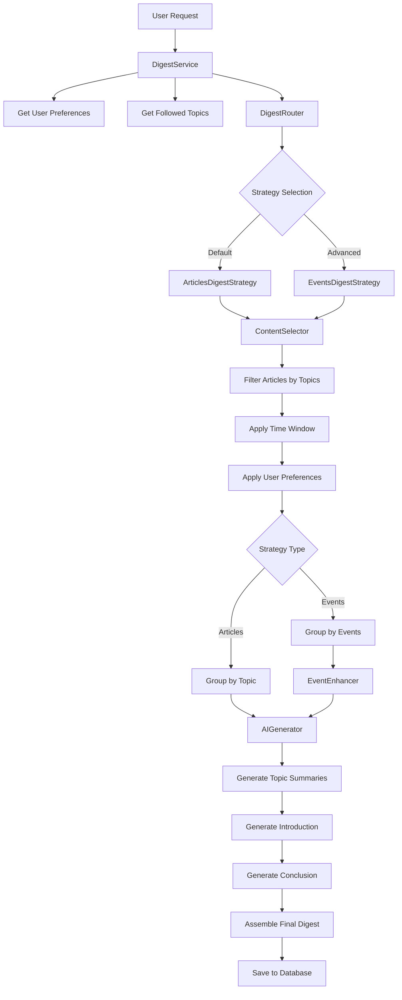

# Daily Digest System

The Daily Digest System is the core content generation service of DailyBrief that creates personalized, AI-powered news summaries for users. It orchestrates the entire digest creation pipeline from content selection to final delivery.

## 🎯 Overview

The Daily Digest System transforms raw news articles into personalized, coherent daily summaries by:

- **Intelligent Content Selection**: Selecting relevant articles based on user preferences and time windows
- **Multi-Strategy Generation**: Supporting both article-based and event-based digest strategies  
- **AI-Powered Synthesis**: Using LLMs to create cohesive narratives from multiple sources
- **Personalization**: Tailoring content to user topics, regions, and preferences
- **Quality Assurance**: Implementing fallbacks, retries, and error handling

## 🏗️ Architecture

### Core Components

```
┌─────────────────┐    ┌──────────────────┐    ┌─────────────────┐
│   DigestService │────│   DigestRouter   │────│ Strategy Pattern│
│   (Orchestrator)│    │   (Dispatcher)   │    │                 │
└─────────────────┘    └──────────────────┘    └─────────────────┘
                                │
                 ┌──────────────┼──────────────┐
                 │                             │
        ┌─────────────────┐           ┌─────────────────┐
        │ ArticlesDigest  │           │  EventsDigest   │
        │   Strategy      │           │   Strategy      │
        └─────────────────┘           └─────────────────┘
                 │                             │
        ┌─────────────────┐           ┌─────────────────┐
        │  ContentSelector│           │  ContentSelector│
        │   AIGenerator   │           │   AIGenerator   │
        │                 │           │   EventEnhancer │
        └─────────────────┘           └─────────────────┘
```

### Service Layers

1. **Orchestration Layer** (`DigestService`)
   - User digest management
   - Transaction coordination
   - Error handling and status tracking

2. **Routing Layer** (`DigestRouter`)
   - Strategy selection and fallback
   - Performance monitoring
   - Configuration management

3. **Strategy Layer** (`ArticlesDigestStrategy`, `EventsDigestStrategy`)
   - Content generation implementation
   - Algorithm-specific logic
   - Data transformation

4. **Support Services**
   - `ContentSelector`: Article filtering and ranking
   - `AIGenerator`: LLM interactions and prompt management
   - `EventEnhancer`: Event clustering and enrichment

## 📊 Data Flow

### High-Level Workflow



## 🔄 Generation Strategies

### 1. Articles-Based Strategy (Default)

**Purpose**: Fast, reliable digest generation using direct article processing

**Process**:
1. Select articles by user topics within time window (48h default)
2. Group articles by topic
3. Generate AI topic summaries from article abstracts
4. Create one story per topic
5. Generate introduction and conclusion

**Characteristics**:
- ⚡ Fast (~30 seconds)
- 🛡️ Highly reliable
- 📊 Broad topic coverage
- 💰 Lower AI costs (4-6 LLM calls)

### 2. Events-Based Strategy (Advanced)

**Purpose**: Deep, event-focused digest generation with clustering

**Process**:
1. Select articles by user topics within time window
2. Detect and cluster events from articles
3. Score and rank events by importance
4. Enhance events with related articles
5. Generate event summaries and topic abstractions
6. Create multiple stories per topic based on events

**Characteristics**:
- 🔍 Deep event analysis
- 🧠 Sophisticated clustering
- 📈 Higher complexity
- ⏱️ Slower (~75 seconds)
- 💰 Higher AI costs (10+ LLM calls)

## ⚙️ Configuration

### Time Windows

The system supports flexible time windows for content selection:

```python
# User preferences
"time_window": "48h"  # Default: 48 hours
# Options: "24h", "48h", "72h", "full_previous_day", "full_previous_2_days"
```

### Strategy Selection

**Global Default**:
```bash
./docker.sh django set_digest_strategy --strategy articles_based
```

**User-Specific**:
```python
# In user's digest_preferences
{
    "digest_strategy": "articles_based",  # or "events_based"
    "max_topics": 6,
    "max_articles_per_topic": 30,
    "time_window": "48h"
}
```

## 📋 API Reference

### DigestService

```python
class DigestService:
    def generate_user_digest(user: User, date: datetime.date, force_regenerate: bool = False) -> Digest
    def get_user_digest(user: User, date: datetime.date) -> Optional[Digest]
    def get_recent_digests(user: User, limit: int = 7) -> List[Digest]
    def get_available_strategies() -> Dict[str, str]
    def set_default_strategy(strategy_name: str) -> bool
```

### Models

**Digest**: Main digest container
- User association and metadata
- Generation status and performance metrics
- Content (introduction, conclusion, HTML)

**DigestTopic**: Topic-level summaries
- AI-generated abstracts and key facts
- Topic-specific statistics

**DigestStory**: Individual event stories
- Enhanced event summaries
- Article recommendations
- Event scoring and metadata

## 🔧 Management Commands

### Generation
```bash
# Generate digest for specific user
./docker.sh django generate_digest --user-id 1

# Generate for all users
./docker.sh django generate_digest --all-users

# Generate for specific date
./docker.sh django generate_digest --user-id 1 --date 2024-12-21

# Force regeneration
./docker.sh django generate_digest --user-id 1 --regenerate
```

### Strategy Management
```bash
# Check current strategy
./docker.sh django set_digest_strategy --show-current

# Change default strategy
./docker.sh django set_digest_strategy --strategy articles_based

# List available strategies
./docker.sh django set_digest_strategy --list
```

### Testing
```bash
# Test digest routing
./docker.sh django test_digest_routing --user-id 1 --strategy articles_based

# Compare strategies
./docker.sh django test_digest_routing --user-id 1 --compare

# Display existing digest
./docker.sh django display_digest --user-id 1 --date 2024-12-21
```

## 🔍 Monitoring & Debugging

### Key Metrics
- **Generation Time**: Target <30s for articles-based, <75s for events-based
- **Success Rate**: >95% for articles-based, >90% for events-based  
- **Cost per Digest**: ~$0.05-0.15 depending on strategy and content volume

### Log Patterns
```
INFO digest_service: Starting digest generation for user username on 2024-12-21
INFO digest_router: Selected strategy 'Articles-Based Digest' for user username
INFO articles_digest_strategy: Generated 4 topics, 19 articles, 12 stories
INFO digest_service: Successfully generated digest using Articles-Based Digest in 30000ms
```

### Error Handling
- **Strategy Fallback**: Events → Articles strategy on failure
- **Retry Logic**: 3 attempts with exponential backoff
- **Graceful Degradation**: Partial content on non-critical failures

## 🔗 Integration Points

### Dependencies
- **Article Pipeline**: Requires completed analyzer, processor, and summarizer stages
- **User Management**: User topics, preferences, and profile data
- **AI Providers**: OpenAI and Anthropic for content generation

### Downstream Services  
- **Frontend API**: Digest delivery via REST endpoints
- **Email Service**: Daily digest notifications
- **Analytics**: Usage tracking and quality metrics

## 📈 Performance Characteristics

| Metric | Articles Strategy | Events Strategy |
|--------|------------------|----------------|
| **Generation Time** | ~30 seconds | ~75 seconds |
| **Reliability** | 99.5% | 95% |
| **AI Calls** | 4-6 | 10-15 |
| **Cost per Digest** | $0.05-0.08 | $0.12-0.18 |
| **Content Depth** | Medium | High |
| **Topic Coverage** | High | Medium |

## 🚀 Future Development

### Planned Enhancements
1. **Hybrid Strategy**: Combine benefits of both approaches
2. **User Learning**: Automatic strategy selection based on engagement
3. **Real-time Generation**: Support for breaking news updates
4. **Multi-language Support**: Localized digest generation
5. **Advanced Personalization**: ML-based content ranking

### Quality Improvements
- Enhanced event clustering algorithms
- Better cross-topic event relationships
- Improved summary coherence
- Real-time feedback integration

---

## 📁 Documentation Structure

- [`README.md`](README.md) - This overview
- [`architecture.md`](architecture.md) - Detailed system architecture
- [`implementation.md`](implementation.md) - Implementation details and patterns
- [`frontend.md`](frontend.md) - Frontend implementation and UI components
- [`api-reference.md`](api-reference.md) - Complete API documentation
- [`commands.md`](commands.md) - Management commands reference
- [`workflows.md`](workflows.md) - Common workflows and examples
- [`performance.md`](performance.md) - Performance analysis and optimization 