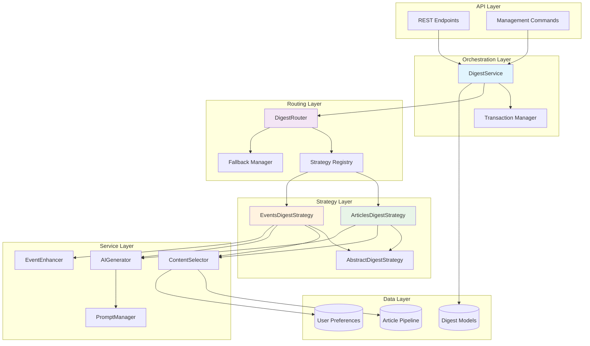
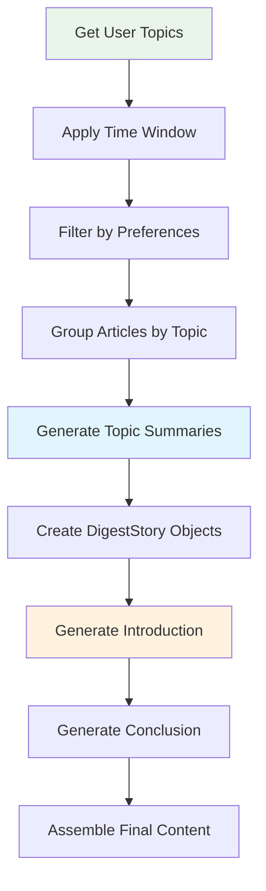
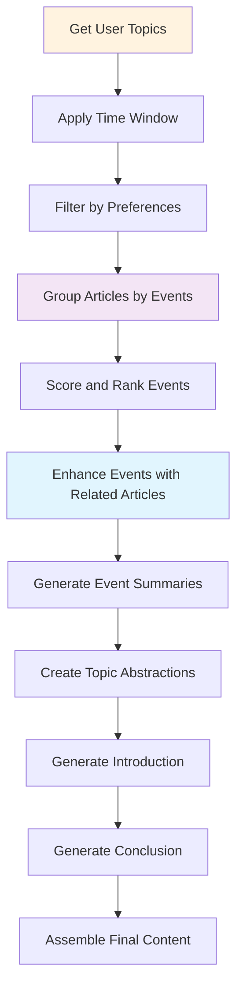

# Digest System Architecture

This document provides a detailed technical overview of the Daily Digest System architecture, component interactions, and design patterns.

## 🏗️ System Overview

The Daily Digest System implements a **layered architecture** with **strategy pattern** for digest generation, enabling multiple generation approaches while maintaining clean separation of concerns.

### Architectural Principles

1. **Strategy Pattern**: Multiple digest generation algorithms (articles-based, events-based)
2. **Layered Architecture**: Clear separation between orchestration, routing, and generation
3. **Dependency Injection**: Services injected for testability and flexibility
4. **Fail-Safe Design**: Automatic fallbacks and error recovery
5. **Transaction Safety**: Database consistency with ACID transactions

## 📊 Component Architecture

### High-Level System Diagram



## 🔄 Service Interactions

### 1. Orchestration Layer

#### DigestService
**Role**: Main entry point and transaction coordinator

**Responsibilities**:
- User digest lifecycle management
- Transaction boundary management
- Error handling and status tracking
- Performance monitoring

**Key Methods**:
```python
def generate_user_digest(user: User, date: datetime.date, force_regenerate: bool = False) -> Digest:
    """
    Orchestrates complete digest generation flow:
    1. Validate user and preferences
    2. Create/update digest record
    3. Route to appropriate strategy
    4. Handle success/failure states
    5. Update performance metrics
    """
```

**Database Interactions**:
- Creates `Digest` records with status tracking
- Updates generation metadata
- Maintains transaction consistency

### 2. Routing Layer

#### DigestRouter
**Role**: Strategy selection and execution coordinator

**Responsibilities**:
- Strategy selection based on configuration
- Fallback management
- Strategy performance tracking
- Configuration validation

**Strategy Selection Logic**:
```python
def _select_strategy(self, user: User, preferences: Dict[str, Any]) -> str:
    """
    Strategy selection priority:
    1. User-specific preference
    2. Global configuration
    3. Django settings
    4. Hardcoded default ('articles_based')
    """
```

**Fallback Chain**:
```
Primary Strategy → Articles Strategy → Error Propagation
```

### 3. Strategy Layer

#### AbstractDigestStrategy
**Role**: Base class defining generation interface

**Contract**:
```python
class AbstractDigestStrategy:
    def generate_digest_content(
        self,
        digest: Digest,
        followed_topics: List[Topic],
        preferences: Dict[str, Any]
    ) -> Dict[str, Any]:
        """Generate complete digest content"""
        raise NotImplementedError
```

#### ArticlesDigestStrategy
**Role**: Simple, reliable article-based generation

**Process Flow**:


#### EventsDigestStrategy
**Role**: Advanced event-based generation with clustering

**Process Flow**:


## 🔧 Service Layer Components

### ContentSelector

**Purpose**: Intelligent article selection and filtering

**Key Capabilities**:
- Time window calculation based on user preferences
- Topic-based filtering
- Region and language preferences
- Article quality filtering

**Time Window Logic**:
```python
def _calculate_date_range_from_preferences(
    self,
    target_date: datetime.date,
    preferences: Dict[str, Any],
    user_timezone: str = 'UTC'
) -> Tuple[datetime, datetime]:
    """
    Supported time windows:
    - "24h": Last 24 hours from end of target date
    - "48h": Last 48 hours from end of target date (default)
    - "72h": Last 72 hours from end of target date
    - "full_previous_day": Complete previous day in user timezone
    - "full_previous_2_days": Complete 2 previous days in user timezone
    """
```

### AIGenerator

**Purpose**: LLM interaction and content generation management

**Key Features**:
- Multi-provider support (OpenAI, Anthropic)
- Prompt template management
- Token counting and cost tracking
- Retry logic with exponential backoff

**Generation Methods**:
```python
def generate_topic_summary_from_articles(articles: List[Article], topic: Topic) -> Dict[str, Any]
def generate_digest_introduction(topics_data: List[Dict], user: User) -> Dict[str, Any]
def generate_digest_conclusion(introduction: str, topic_abstracts: List[str]) -> Dict[str, Any]
def enhance_event_summary_with_related(event_data: Dict[str, Any]) -> Dict[str, Any]
```

**Cost Tracking**:
- Per-generation cost calculation
- Aggregate cost reporting
- Budget monitoring and alerts

### EventEnhancer

**Purpose**: Event clustering and semantic analysis

**Key Algorithms**:
- Cosine similarity for event clustering
- Related article discovery
- Event importance scoring
- Cross-topic event relationships

**Scoring Formula**:
```python
def _calculate_comprehensive_event_score_with_clusters(event_data, all_events_data):
    """
    Score = (primary_mentions × 2) + (secondary_mentions × 1) + (related_events × 0.5)
    
    - primary_mentions: Articles where this is the main event
    - secondary_mentions: Articles mentioning this event secondarily
    - related_events: Semantically similar events (cosine distance < 0.30)
    """
```

## 💾 Data Architecture

### Database Models

#### Digest Model
```python
class Digest(models.Model):
    # Identity
    public_id = UUIDField()
    user = ForeignKey(User)
    date = DateField()
    
    # Content
    title = CharField()
    introduction = TextField()
    conclusion = TextField()
    html_content = TextField()
    
    # Status tracking
    generation_status = CharField(choices=[...])
    error_message = TextField()
    
    # Performance metrics
    generation_duration_ms = IntegerField()
    generation_cost_usd = DecimalField()
    articles_processed = IntegerField()
    events_included = IntegerField()
    topics_included = IntegerField()
    
    # AI metadata
    ai_model_used = CharField()
    tokens_input = IntegerField()
    tokens_output = IntegerField()
```

#### DigestTopic Model
```python
class DigestTopic(models.Model):
    digest = ForeignKey(Digest)
    topic = ForeignKey(Topic)
    
    # AI-generated content
    topic_abstract = TextField()
    main_facts = JSONField()  # List[str]
    perspectives = JSONField()  # List[str]
    
    # Metadata
    order = IntegerField()
    event_count = IntegerField()
    article_count = IntegerField()
    
    # Cost tracking
    generation_cost_usd = DecimalField()
    tokens_input = IntegerField()
    tokens_output = IntegerField()
```

#### DigestStory Model
```python
class DigestStory(models.Model):
    digest = ForeignKey(Digest)
    digest_topic = ForeignKey(DigestTopic)
    event = ForeignKey(Event, null=True)
    
    # Content
    title = CharField()
    summary = TextField()
    enhanced_abstract = TextField()
    key_facts = JSONField()  # List[str]
    perspectives = JSONField()  # List[str]
    
    # Article relationships
    recommended_articles = ManyToManyField(Article)
    articles = ManyToManyField(Article)  # Legacy
    
    # Event metrics
    article_count = IntegerField()
    primary_mentions = IntegerField()
    secondary_mentions = IntegerField()
    event_score = FloatField()
    
    # Display
    order = IntegerField()
```

### Data Flow Patterns

#### Content Generation Flow
```
Articles (Processed) 
    ↓
ContentSelector (Filter + Group)
    ↓
Strategy (Generate Summaries)
    ↓
AIGenerator (Create Content)
    ↓
DigestModels (Persist)
```

#### Event Enhancement Flow
```
Events (Detected)
    ↓
EventEnhancer (Cluster + Score)
    ↓
ContentSelector (Related Articles)
    ↓
AIGenerator (Enhanced Summaries)
    ↓
DigestStory (Enhanced Content)
```

## 🔐 Security & Performance

### Security Considerations

1. **User Isolation**: Strict user-based filtering
2. **Input Validation**: All user preferences validated
3. **SQL Injection Prevention**: ORM-only database access
4. **API Rate Limiting**: AI provider rate limit compliance

### Performance Optimizations

1. **Query Optimization**:
   - Selective prefetching
   - Index-optimized queries
   - Batch processing

2. **AI Cost Management**:
   - Prompt optimization
   - Response caching
   - Token limit enforcement

3. **Concurrent Processing**:
   - Parallel topic generation
   - Async AI calls where possible
   - Database connection pooling

### Monitoring & Observability

#### Key Metrics
```python
# Performance metrics
generation_duration_ms  # Target: <30s articles, <75s events
generation_cost_usd     # Target: <$0.15 per digest
success_rate           # Target: >95% articles, >90% events

# Quality metrics
user_engagement_rate   # Click-through on stories
content_diversity      # Topics and sources covered
ai_token_efficiency    # Tokens per story generated
```

#### Logging Strategy
```python
# Structured logging with correlation IDs
logger.info(
    "digest_generation_started",
    extra={
        "user_id": user.id,
        "date": str(date),
        "strategy": strategy_name,
        "correlation_id": correlation_id
    }
)
```

## 🔄 Error Handling & Recovery

### Error Categories

1. **User Errors**: No topics, insufficient content
2. **System Errors**: Database connectivity, AI provider failures
3. **Data Errors**: Malformed articles, missing relationships
4. **Resource Errors**: Rate limits, timeouts

### Recovery Strategies

1. **Automatic Fallback**: Events strategy → Articles strategy
2. **Retry Logic**: Exponential backoff for transient failures
3. **Graceful Degradation**: Partial content on non-critical failures
4. **Circuit Breaker**: AI provider failure protection

### Error States

```python
# Digest generation states
PENDING → PROCESSING → {COMPLETED | FAILED}

# Recovery paths
FAILED → PROCESSING (manual retry)
PROCESSING → FAILED (timeout)
```

## 🚀 Scalability Considerations

### Horizontal Scaling
- Stateless service design
- Database-only state persistence
- Load balancer compatibility

### Vertical Scaling
- Memory-efficient article processing
- Streaming AI responses
- Optimized database queries

### Future Architecture Evolution
- Microservice decomposition readiness
- Event-driven architecture support
- Caching layer integration points

---

This architecture provides a solid foundation for reliable, scalable digest generation while maintaining flexibility for future enhancements and optimizations. 