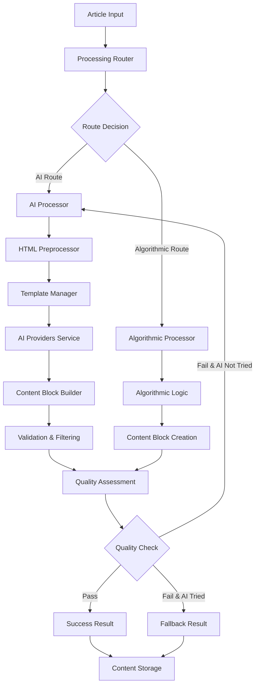

# AI Content Processing Architecture

## Overview

The AI Content Processing Pipeline is built on a modular architecture that enhances our existing content extraction capabilities with intelligent AI-powered semantic understanding, while maintaining robust error handling and cost optimization.

## Core Architecture Principles

### 1. Domain-Driven Design
Following DDD principles with clear service boundaries:

```
Content Processing Domain
├── Core Services
│   ├── AI Processor          # Semantic content extraction
│   ├── Algorithmic Processor # Traditional rule-based extraction  
│   ├── Processing Router     # Intelligent routing between processors
│   └── Content Validator     # Quality assessment integration
├── Supporting Services  
│   ├── Block Builder         # ContentBlock object construction
│   ├── Template Manager      # AI prompt template management
│   ├── Retry Manager         # Smart retry logic coordination
│   └── Filter Manager        # Language/region filtering logic
└── External Dependencies
    ├── AI Providers Service  # LLM abstraction layer
    ├── Quality Service       # Content quality evaluation
    └── Content Models        # Shared data structures
```

### 2. Service Boundaries & Responsibilities

#### **AI Processor Service** (`ai_processor.py`)
- **Purpose**: Orchestrate AI-powered content extraction
- **Responsibilities**:
  - Coordinate extraction pipeline from HTML to ContentBlocks
  - Manage AI service interactions and error handling
  - Apply retry logic for failed extractions
  - Integrate with quality assessment for routing decisions

#### **Content Block Builder** (`content_block_builder.py`) 
- **Purpose**: Convert AI JSON responses to domain objects
- **Responsibilities**:
  - Transform JSON responses into ContentBlock objects
  - Validate content block structure and metadata
  - Filter invalid blocks while preserving valid ones
  - Apply content type-specific validation rules

#### **Extraction Templates** (`extraction_templates.py`)
- **Purpose**: Manage AI prompt templates for content extraction
- **Responsibilities**:
  - Define structured prompts for different content types
  - Provide few-shot examples for AI calibration
  - Handle template versioning and selection
  - Optimize prompts for token efficiency

#### **Processing Services** (`services.py`)
- **Purpose**: High-level processing orchestration and routing
- **Responsibilities**:
  - Route between AI and algorithmic processors
  - Apply business logic for processing decisions
  - Coordinate retry and error handling strategies
  - Manage processing workflow states

## Component Relationships



## Enhanced Features Architecture

### 1. Graceful Error Handling

```python
# Block Filtering Strategy
class ContentBlockBuilder:
    def build_blocks(self, blocks_data: List[dict]) -> List[ContentBlock]:
        valid_blocks = []
        invalid_count = 0
        
        for block_data in blocks_data:
            if self._validate_block_structure(block_data):
                valid_blocks.append(self._create_block(block_data))
            else:
                invalid_count += 1
                logger.warning(f"Filtered invalid block: {block_data.get('type', 'unknown')}")
        
        logger.info(f"Filtered {invalid_count} invalid blocks, preserved {len(valid_blocks)} valid blocks")
        return valid_blocks
```

**Architecture Benefits:**
- **Fault Tolerance**: System continues processing despite individual block failures
- **Content Preservation**: Valid content is never lost due to isolated errors
- **Transparency**: Clear logging of what was filtered and why

### 2. Smart Retry Logic

```python
# Retry Decision Architecture
class AIProcessor:
    def _should_retry_ai_failure(self, error_message: str, attempt_count: int) -> bool:
        if attempt_count >= 3:
            return False
            
        # Transient errors (retryable)
        transient_indicators = [
            "timeout", "rate_limit", "503", "502", "500",
            "network", "connection", "unavailable"
        ]
        
        # Permanent errors (no retry)
        permanent_indicators = [
            "invalid_json", "parsing_failed", "token_limit",
            "invalid_content", "unsupported_format"
        ]
        
        error_lower = error_message.lower()
        
        if any(indicator in error_lower for indicator in permanent_indicators):
            return False
        if any(indicator in error_lower for indicator in transient_indicators):
            return True
            
        return True  # Default to retry for unknown errors
```

**Architecture Benefits:**
- **Efficiency**: Avoids unnecessary retries for permanent failures
- **Reliability**: Retries transient failures with exponential backoff
- **Resource Management**: Limits retry attempts to prevent infinite loops

### 3. Token Management Architecture

```python
# Model-Specific Token Limits
class AIService:
    def get_max_output_tokens(self, model_name: str) -> int:
        """Get maximum output tokens based on model capabilities."""
        token_limits = {
            "gpt-4.1-preview": 30000,  # Approaching 32,768 max
            "gpt-4o": 8000,           # Safe margin for 128k context
            "gpt-4": 8000,            # Conservative for reliability
            "gpt-3.5-turbo": 4000,    # Standard limit
        }
        
        return token_limits.get(model_name, 4000)  # Conservative default
```

**Architecture Benefits:**
- **Completeness**: Large articles processed without truncation
- **Model Optimization**: Leverages full capabilities of each model
- **Cost Efficiency**: Balances completeness with token costs

## Integration Architecture

### 1. Quality Service Integration

```python
# Quality-Based Processing Decisions
class ProcessingRouter:
    def determine_route(self, article) -> str:
        # Route based on content complexity, source quality, user preferences
        if self._requires_ai_processing(article):
            return "ai_enhanced"
        return "algorithmic"
    
    def _requires_ai_processing(self, article) -> bool:
        # Consider: publication type, content complexity, previous quality scores
        return (
            article.publication.requires_ai_processing or
            article.estimated_complexity > 0.7 or
            getattr(article, 'previous_quality_score', 0) < 0.5
        )
```

### 2. AIProviders Service Integration

```python
# Centralized AI Service Usage
class AIProcessor:
    def __init__(self):
        from apps.aiproviders.services import get_ai_service
        self.ai_service = get_ai_service()
        self.template_manager = ExtractionTemplateManager()
    
    def extract_content(self, html: str, metadata: dict) -> ProcessingResult:
        # Delegate to centralized AI service
        response = self.ai_service.call_llm(
            prompt=self.template_manager.format_prompt(html, metadata),
            operation="content_extraction",
            max_tokens=self._get_optimal_token_limit(),
            temperature=0.1,
            response_format="json"
        )
        return self._process_response(response)
```

## Data Flow Architecture

### 1. Processing Pipeline

```
Input: Raw HTML + Metadata
├── 1. Route Decision (AI vs Algorithmic)
├── 2. HTML Preprocessing (Structure preservation)
├── 3. AI Processing
│   ├── Template Selection & Formatting
│   ├── LLM API Call (via AIProviders)
│   ├── Response Parsing & Validation
│   └── Block Building & Filtering
├── 4. Quality Assessment
├── 5. Retry Logic (if needed)
└── Output: Structured ContentBlocks + Metadata
```

### 2. Error Handling Flow

```
Processing Error Occurs
├── 1. Error Classification
│   ├── Transient (retry eligible)
│   └── Permanent (no retry)
├── 2. Attempt Tracking
│   ├── Increment attempt counter
│   └── Update last attempt timestamp
├── 3. Retry Decision
│   ├── Check attempt limit (max 3)
│   ├── Evaluate error type
│   └── Apply backoff strategy
└── 4. Fallback Strategy
    ├── Try algorithmic processor
    └── Mark as failed with detailed logging
```

## Scalability Architecture

### 1. Processing Optimization

```python
# Efficient Batch Processing
class BatchProcessor:
    def process_articles_batch(self, articles: List[Article], filters: dict):
        # Apply filtering before processing
        filtered_articles = self._apply_filters(articles, filters)
        
        # Process in parallel with resource management
        with ThreadPoolExecutor(max_workers=3) as executor:
            futures = [
                executor.submit(self._process_single_article, article)
                for article in filtered_articles
            ]
            
            for future in as_completed(futures):
                self._handle_processing_result(future.result())
```

### 2. Resource Management

- **Token Budgets**: Track and limit token usage per processing session
- **API Rate Limiting**: Respect provider rate limits with intelligent backoff
- **Memory Management**: Process large articles in chunks when needed
- **Cost Monitoring**: Real-time tracking of processing costs

## Configuration Architecture

### 1. Template Configuration

```python
# Template Registry Pattern
EXTRACTION_TEMPLATES = {
    "comprehensive_v2": {
        "class": ComprehensiveExtractionTemplateV2,
        "use_cases": ["general", "news", "blogs"],
        "token_efficiency": "high",
        "accuracy": "92%"
    },
    "specialized_news": {
        "class": SpecializedNewsTemplate,
        "use_cases": ["news", "journalism"],
        "token_efficiency": "medium",
        "accuracy": "95%"
    }
}
```

### 2. Processing Configuration

```python
# Processing Strategy Configuration
PROCESSING_CONFIG = {
    "ai_processor": {
        "default_template": "comprehensive_v2",
        "max_retries": 3,
        "timeout_seconds": 45,
        "token_budget_per_article": 30000
    },
    "retry_logic": {
        "backoff_strategy": "exponential",
        "base_delay_seconds": 2,
        "max_delay_seconds": 60
    },
    "filtering": {
        "default_languages": ["en", "pt"],
        "default_regions": ["us", "br", "gb"]
    }
}
```

## Monitoring & Observability

### 1. Processing Metrics

- **Success Rates**: Track processing success vs failure rates
- **Quality Scores**: Monitor content quality improvements
- **Processing Times**: Track performance across different content types
- **Cost Tracking**: Monitor token usage and associated costs

### 2. Error Monitoring

- **Error Classification**: Track transient vs permanent error rates
- **Retry Efficiency**: Monitor retry success rates and resource usage
- **Block Filtering**: Track invalid block rates and types
- **Template Performance**: Compare template accuracy and efficiency

This architecture provides a robust, scalable foundation for AI-powered content processing while maintaining compatibility with existing systems and ensuring graceful degradation in error scenarios. 