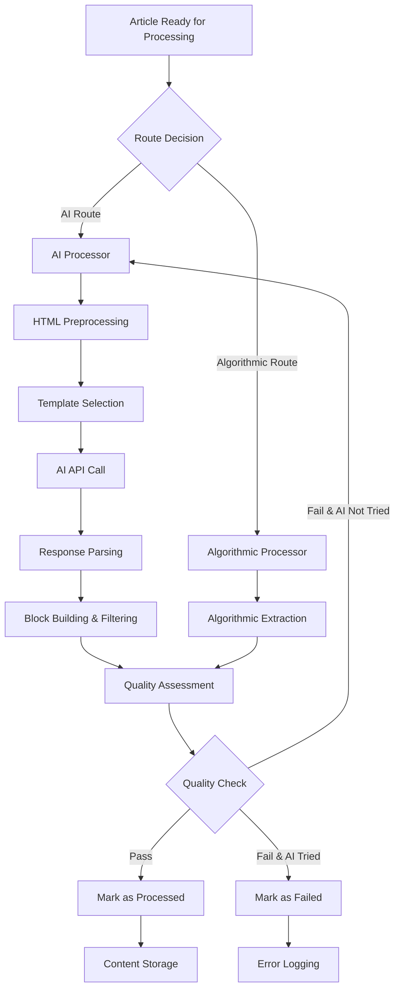
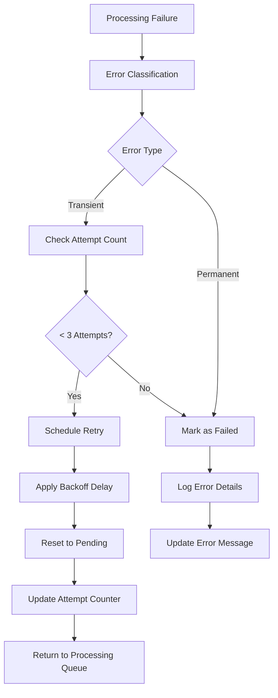

# AI Content Processing Workflows

## Overview

This document outlines the key workflows and operational procedures for the AI content processing pipeline, including processing routines, error handling, monitoring, and optimization strategies.

## Core Processing Workflows

### 1. Standard Article Processing Workflow



#### Step-by-Step Process

1. **Input Validation**
   - Check article status (must be 'pending')
   - Validate required fields (raw_html, title, url)
   - Apply language/region filters if specified

2. **Route Decision**
   - Analyze content complexity
   - Check publication preferences
   - Consider previous processing history

3. **AI Processing** (if selected)
   - Preprocess HTML for token optimization
   - Select appropriate extraction template
   - Make AI API call with retry logic
   - Parse JSON response with validation
   - Build content blocks with error filtering

4. **Quality Assessment**
   - Evaluate extraction completeness
   - Calculate quality scores
   - Determine if re-processing needed

5. **Result Storage**
   - Save content blocks and metadata
   - Update article processing status
   - Log processing metrics and costs

### 2. Retry Workflow



#### Retry Logic Implementation

```python
def process_with_retry(article):
    """Process article with intelligent retry logic."""
    
    max_attempts = 3
    base_delay = 2  # seconds
    
    for attempt in range(1, max_attempts + 1):
        try:
            result = process_article(article)
            
            if result.success:
                return result
            else:
                # Check if we should retry
                should_retry = _should_retry_failure(result.error, attempt)
                
                if should_retry and attempt < max_attempts:
                    delay = base_delay * (2 ** (attempt - 1))  # Exponential backoff
                    time.sleep(delay)
                    continue
                else:
                    return result
                    
        except Exception as e:
            should_retry = _should_retry_exception(e, attempt)
            
            if should_retry and attempt < max_attempts:
                delay = base_delay * (2 ** (attempt - 1))
                time.sleep(delay)
                continue
            else:
                raise e
```

## Operational Workflows

### 1. Daily Processing Routine

```bash
#!/bin/bash
# Daily processing routine

echo "=== Daily AI Processing Routine ==="

# 1. Check system health
echo "1. System Health Check"
./docker.sh django shell -c "
from apps.articles.models import Article
pending = Article.objects.filter(process_status='pending').count()
failed = Article.objects.filter(process_status='ai_failed').count()
print(f'Pending articles: {pending}')
print(f'Failed articles: {failed}')
"

# 2. Process priority languages and regions
echo "2. Processing Priority Content"
./docker.sh django process_ready_articles \
    --languages en,pt \
    --regions us,br,gb \
    --limit 50 \
    --verbose

# 3. Process additional content if capacity allows
echo "3. Processing Additional Content"
./docker.sh django process_ready_articles \
    --limit 20 \
    --verbose

# 4. Check results
echo "4. Processing Results"
./docker.sh django shell -c "
from apps.articles.models import Article
from datetime import datetime, timedelta
from django.utils import timezone

recent = timezone.now() - timedelta(hours=24)
processed_today = Article.objects.filter(
    last_process_attempt__gte=recent,
    process_status='processed'
).count()

failed_today = Article.objects.filter(
    last_process_attempt__gte=recent,
    process_status='ai_failed'
).count()

print(f'Processed today: {processed_today}')
print(f'Failed today: {failed_today}')
if processed_today + failed_today > 0:
    success_rate = (processed_today / (processed_today + failed_today)) * 100
    print(f'Success rate: {success_rate:.1f}%')
"
```

### 2. Error Investigation Workflow

#### Identify Problem Articles

```bash
# 1. Find articles with processing failures
./docker.sh django shell -c "
from apps.articles.models import Article

# Get recent failures
failed_articles = Article.objects.filter(
    process_status='ai_failed',
    process_error_message__isnull=False
).order_by('-last_process_attempt')[:10]

print('Recent failures:')
for article in failed_articles:
    error_preview = article.process_error_message[:60] + '...' if len(article.process_error_message) > 60 else article.process_error_message
    print(f'  {article.public_id}: {error_preview}')
    print(f'    Attempts: {article.process_attempts}')
    print(f'    Last attempt: {article.last_process_attempt}')
    print()
"
```

#### Debug Specific Issues

```bash
# 2. Debug specific article
./docker.sh django debug_ai_processing \
    --article-id <public_id> \
    --show-blocks \
    --show-html

# 3. Analyze error patterns
./docker.sh django shell -c "
from apps.articles.models import Article
from collections import Counter

# Analyze error patterns
failed_articles = Article.objects.filter(
    process_status='ai_failed',
    process_error_message__isnull=False
)

error_types = []
for article in failed_articles:
    error_msg = article.process_error_message.lower()
    if 'timeout' in error_msg:
        error_types.append('timeout')
    elif 'json' in error_msg or 'parsing' in error_msg:
        error_types.append('json_parsing')
    elif 'token' in error_msg:
        error_types.append('token_limit')
    elif 'rate' in error_msg:
        error_types.append('rate_limit')
    else:
        error_types.append('other')

error_counts = Counter(error_types)
print('Error pattern analysis:')
for error_type, count in error_counts.most_common():
    print(f'  {error_type}: {count}')
"
```

#### Resolution Actions

```bash
# 4. Reset articles for retry (if appropriate)
./docker.sh django shell -c "
from apps.articles.models import Article

# Reset articles with transient failures
transient_failures = Article.objects.filter(
    process_status='ai_failed',
    process_error_message__icontains='timeout'
).filter(process_attempts__lt=3)

count = 0
for article in transient_failures:
    article.process_status = 'pending'
    article.process_error_message = ''
    article.save()
    count += 1

print(f'Reset {count} articles with transient failures')
"
```

### 3. Performance Monitoring Workflow

#### Daily Performance Report

```python
# Generate daily performance report
from apps.articles.models import Article
from apps.aiproviders.models import AIUsageLog
from datetime import datetime, timedelta
from django.utils import timezone
from django.db.models import Avg, Sum, Count

def generate_daily_report():
    """Generate comprehensive daily performance report."""
    
    # Define time range (last 24 hours)
    end_time = timezone.now()
    start_time = end_time - timedelta(hours=24)
    
    print(f"=== AI Processing Report ({start_time.strftime('%Y-%m-%d %H:%M')} to {end_time.strftime('%Y-%m-%d %H:%M')}) ===\n")
    
    # Processing Statistics
    processed = Article.objects.filter(
        last_process_attempt__gte=start_time,
        process_status='processed'
    )
    
    failed = Article.objects.filter(
        last_process_attempt__gte=start_time,
        process_status='ai_failed'
    )
    
    total_attempts = processed.count() + failed.count()
    success_rate = (processed.count() / total_attempts * 100) if total_attempts > 0 else 0
    
    print("📊 Processing Statistics:")
    print(f"  Total articles processed: {processed.count()}")
    print(f"  Total failures: {failed.count()}")
    print(f"  Success rate: {success_rate:.1f}%")
    
    # Quality Metrics
    quality_scores = []
    for article in processed:
        if article.content_quality_metrics:
            score = article.content_quality_metrics.get('quality_score', 0)
            if score > 0:
                quality_scores.append(score)
    
    if quality_scores:
        avg_quality = sum(quality_scores) / len(quality_scores)
        print(f"  Average quality score: {avg_quality:.3f}")
        print(f"  Quality range: {min(quality_scores):.3f} - {max(quality_scores):.3f}")
    
    # Cost Analysis
    usage_logs = AIUsageLog.objects.filter(
        created_at__gte=start_time,
        operation='content_extraction'
    )
    
    if usage_logs.exists():
        total_tokens = usage_logs.aggregate(Sum('token_usage'))['token_usage__sum'] or 0
        total_cost = usage_logs.aggregate(Sum('cost'))['cost__sum'] or 0
        avg_tokens = usage_logs.aggregate(Avg('token_usage'))['token_usage__avg'] or 0
        avg_cost = usage_logs.aggregate(Avg('cost'))['cost__avg'] or 0
        
        print(f"\n💰 Cost Analysis:")
        print(f"  Total tokens used: {total_tokens:,}")
        print(f"  Total cost: ${total_cost:.3f}")
        print(f"  Average tokens per article: {avg_tokens:.0f}")
        print(f"  Average cost per article: ${avg_cost:.3f}")
    
    # Error Analysis
    if failed.exists():
        print(f"\n❌ Error Analysis:")
        
        # Group errors by type
        error_patterns = {}
        for article in failed:
            error_msg = article.process_error_message.lower()
            if 'timeout' in error_msg:
                error_patterns['timeout'] = error_patterns.get('timeout', 0) + 1
            elif 'json' in error_msg or 'parsing' in error_msg:
                error_patterns['json_parsing'] = error_patterns.get('json_parsing', 0) + 1
            elif 'token' in error_msg:
                error_patterns['token_limit'] = error_patterns.get('token_limit', 0) + 1
            elif 'rate' in error_msg:
                error_patterns['rate_limit'] = error_patterns.get('rate_limit', 0) + 1
            else:
                error_patterns['other'] = error_patterns.get('other', 0) + 1
        
        for error_type, count in sorted(error_patterns.items()):
            print(f"  {error_type}: {count}")
    
    print("\n" + "="*50)

# Run the report
generate_daily_report()
```

### 4. Data Quality Maintenance Workflow

#### Weekly Data Quality Check

```bash
#!/bin/bash
# Weekly data quality maintenance

echo "=== Weekly Data Quality Check ==="

# 1. Check publication region assignments
echo "1. Publication Region Check"
./docker.sh django shell -c "
from apps.feeds.models import Publication

no_regions = Publication.objects.filter(regions__isnull=True).count()
print(f'Publications without regions: {no_regions}')

if no_regions > 0:
    print('Run: ./docker.sh django fix_publication_regions --dry-run')
"

# 2. Check for articles stuck in processing
echo "2. Stuck Articles Check"
./docker.sh django shell -c "
from apps.articles.models import Article
from datetime import datetime, timedelta
from django.utils import timezone

# Articles in processing state for more than 1 hour
cutoff = timezone.now() - timedelta(hours=1)
stuck_articles = Article.objects.filter(
    process_status='processing',
    last_process_attempt__lt=cutoff
)

if stuck_articles.exists():
    print(f'Found {stuck_articles.count()} stuck articles')
    print('Consider resetting these to pending status')
else:
    print('No stuck articles found')
"

# 3. Content quality distribution
echo "3. Content Quality Distribution"
./docker.sh django shell -c "
from apps.articles.models import Article

# Quality score distribution
quality_ranges = {
    'excellent': 0,
    'good': 0,
    'fair': 0,
    'poor': 0,
    'failed': 0
}

articles = Article.objects.filter(
    process_status='processed',
    content_quality_metrics__isnull=False
)

for article in articles:
    score = article.content_quality_metrics.get('quality_score', 0)
    if score >= 0.8:
        quality_ranges['excellent'] += 1
    elif score >= 0.6:
        quality_ranges['good'] += 1
    elif score >= 0.4:
        quality_ranges['fair'] += 1
    elif score >= 0.2:
        quality_ranges['poor'] += 1
    else:
        quality_ranges['failed'] += 1

total = sum(quality_ranges.values())
if total > 0:
    print('Quality distribution:')
    for range_name, count in quality_ranges.items():
        percentage = (count / total) * 100
        print(f'  {range_name}: {count} ({percentage:.1f}%)')
"
```

## Emergency Procedures

### 1. High Failure Rate Response

If processing failure rate exceeds 50%:

```bash
# 1. Immediate assessment
./docker.sh django shell -c "
from apps.articles.models import Article
from datetime import datetime, timedelta
from django.utils import timezone

recent = timezone.now() - timedelta(hours=1)
recent_attempts = Article.objects.filter(last_process_attempt__gte=recent)
failed = recent_attempts.filter(process_status='ai_failed').count()
total = recent_attempts.count()

if total > 0:
    failure_rate = (failed / total) * 100
    print(f'Recent failure rate: {failure_rate:.1f}%')
    
    if failure_rate > 50:
        print('🚨 HIGH FAILURE RATE DETECTED')
        print('Recommended actions:')
        print('1. Check AI service status')
        print('2. Review error messages')
        print('3. Consider pausing processing')
"

# 2. Pause processing if needed
# Stop celery workers
docker stop dailybrief-celery_worker-1
docker stop dailybrief-celery_beat-1

# 3. Investigate root cause
# Check common error patterns, API status, etc.

# 4. Resume when resolved
docker start dailybrief-celery_worker-1
docker start dailybrief-celery_beat-1
```

### 2. Cost Budget Exceeded

If daily processing costs exceed budget:

```bash
# 1. Check current spend
./docker.sh django shell -c "
from apps.aiproviders.models import AIUsageLog
from datetime import datetime, timedelta
from django.utils import timezone
from django.db.models import Sum

today = timezone.now().date()
today_start = timezone.make_aware(datetime.combine(today, datetime.min.time()))

today_cost = AIUsageLog.objects.filter(
    created_at__gte=today_start,
    operation='content_extraction'
).aggregate(Sum('cost'))['cost__sum'] or 0

print(f'Today total cost: \${today_cost:.3f}')

# Set your daily budget limit
DAILY_BUDGET = 50.00
if today_cost > DAILY_BUDGET:
    print(f'🚨 BUDGET EXCEEDED (limit: \${DAILY_BUDGET:.2f})')
    print('Consider pausing processing until tomorrow')
"

# 2. Implement emergency pause if needed
# Pause processing until next day or budget reset
```

This workflow documentation provides comprehensive operational procedures for managing the AI content processing pipeline effectively and handling various scenarios that may arise during operation. 