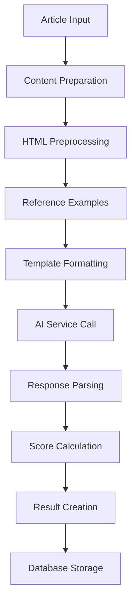
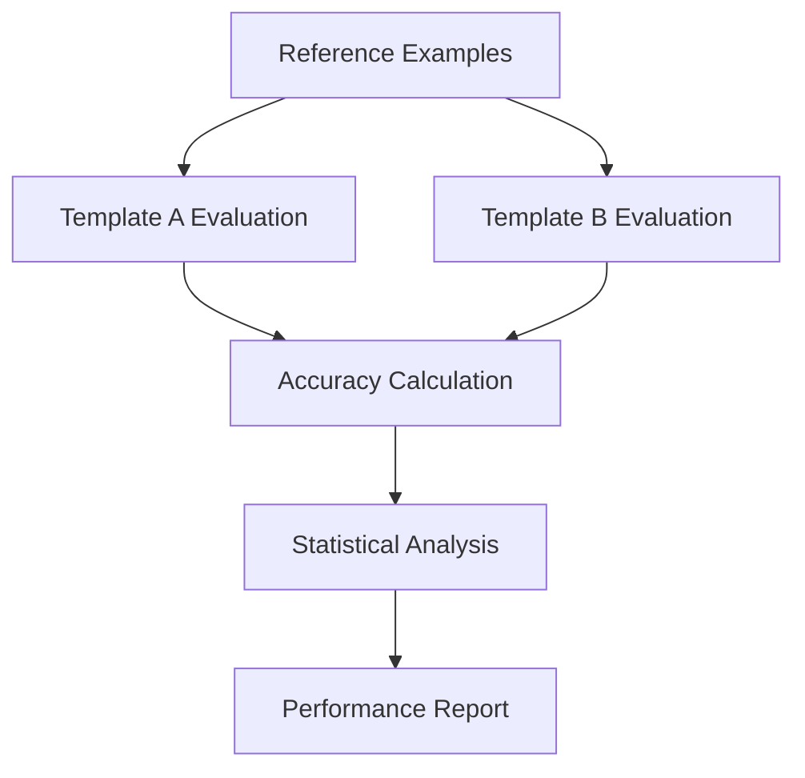

# Content Quality Assessment Architecture

> **System design and component relationships for AI-powered content quality evaluation**

## Overview

The Content Quality Assessment System is designed as a modular, domain-driven architecture that separates content quality business logic from AI infrastructure. This ensures maintainability, testability, and flexibility in AI provider selection.

## High-Level Architecture

```
┌─────────────────────────────────────────────────────────────────┐
│                    Content Quality System                       │
├─────────────────────────────────────────────────────────────────┤
│  Management Layer                                               │
│  ├── Django Management Commands                                 │
│  ├── Batch Processing & Analysis                               │
│  └── Template Comparison Framework                             │
├─────────────────────────────────────────────────────────────────┤
│  Core Assessment Engine                                         │
│  ├── ContentQualityEvaluator (Orchestration)                  │
│  ├── Template System (Prompt Management)                      │
│  ├── Domain Scoring Logic (Mathematical Formulas)             │
│  └── HTML Preprocessing (Structure Preservation)              │
├─────────────────────────────────────────────────────────────────┤
│  Reference & Calibration                                       │
│  ├── ReferenceQualityExample (Ground Truth)                   │
│  ├── Few-Shot Learning (Template-based)                       │
│  └── Quality Classification System                            │
├─────────────────────────────────────────────────────────────────┤
│  Data & Persistence                                            │
│  ├── QualityScoring (Results Storage)                         │
│  ├── QualityAssessmentResult (Domain Model)                   │
│  └── Article Integration (Content Source)                     │
├─────────────────────────────────────────────────────────────────┤
│  Infrastructure Dependencies                                    │
│  ├── AI Service Abstraction (@aiproviders)                    │
│  ├── Cost Tracking & Token Management                         │
│  └── Model Selection & Configuration                          │
└─────────────────────────────────────────────────────────────────┘
```

## Core Components

### 1. ContentQualityEvaluator

**Purpose**: Central orchestration of the quality evaluation process

**Key Responsibilities**:
- Content preparation and formatting
- HTML preprocessing coordination
- Template management and prompt generation
- AI service interaction
- Result parsing and domain score calculation

**Location**: `backend/apps/content/quality/evaluator.py`

```python
class ContentQualityEvaluator:
    def __init__(self, template_id: Optional[str] = None)
    def evaluate_article_quality(self, article: Article, ...) -> QualityAssessmentResult
    def _prepare_extracted_content(self, article: Article) -> Dict[str, Any]
    def _prepare_html_sample(self, article: Article, ...) -> Dict[str, Any]
    def _prepare_reference_examples(self, max_per_class: int = 1) -> str
```

### 2. Template System

**Purpose**: Modular prompt template management with version control

**Key Components**:
- `BasePromptTemplate`: Abstract base for all templates
- `ComprehensiveQualityEvaluator`: Baseline XML-structured template
- `StructuredRubricEvaluator`: Anchor-based evaluation template
- `FewShotExampleTemplate`: Reference example formatting

**Location**: `backend/apps/content/quality/prompt_templates.py`

```python
class BasePromptTemplate(ABC):
    @property
    def metadata(self) -> PromptTemplateMetadata
    @property  
    def template_text(self) -> str
    def format(self, **kwargs) -> str
```

### 3. Domain Scoring Logic

**Purpose**: Programmatic calculation of overall quality scores using domain-specific formula

**Formula Implementation**:
```python
def calculate_overall_score(completeness, purity, structure, readability):
    base_score = completeness - (1 - purity)  # Range: -1 to +1
    structure_bonus = (structure - 0.5) * 0.3  # ±0.15 adjustment
    readability_bonus = (readability - 0.5) * 0.2  # ±0.10 adjustment
    return max(-1.0, min(1.0, base_score + structure_bonus + readability_bonus))
```

**Location**: `backend/apps/content/quality/models.py` (QualityScoring class)

### 4. HTML Preprocessing System

**Purpose**: Intelligent HTML optimization for quality evaluation

**Key Features**:
- Structure preservation with semantic HTML tags
- Noise reduction (scripts, styles, navigation)
- Token optimization for LLM context limits
- Content density analysis

**Location**: `backend/apps/content/quality/html_preprocessor.py`

## Data Models

### QualityAssessmentResult (Domain Model)

Pure domain object representing evaluation results:

```python
@dataclass
class QualityAssessmentResult:
    # Core quality metrics (0 to 1 scale)
    overall_score: float      # Final score (-1 to +1)
    completeness: float       # How much content was captured (0-1)
    purity: float            # How clean the content is (0-1)
    structure: float         # How well structure is preserved (0-1)
    readability: float       # How readable the content is (0-1)
    
    # Meta information
    confidence: float
    explanation: str
    missing_elements: List[str]
    noise_detected: List[str]
    
    # Technical metadata
    evaluation_time: float
    model_used: str
    tokens_used: int
    cost_usd: Decimal
```

### QualityScoring (Database Model)

Persistent storage with database-optimized fields:

```python
class QualityScoring(models.Model):
    # Relationships
    article = models.ForeignKey('articles.Article')
    
    # Quality scores (DecimalField for precision)
    overall_score = models.DecimalField(max_digits=4, decimal_places=3)
    completeness_score = models.DecimalField(max_digits=4, decimal_places=3)
    purity_score = models.DecimalField(max_digits=4, decimal_places=3)
    structure_score = models.DecimalField(max_digits=4, decimal_places=3)
    readability_score = models.DecimalField(max_digits=4, decimal_places=3)
    
    # Assessment metadata
    assessment_method = models.CharField(max_length=50)
    confidence_score = models.DecimalField(max_digits=4, decimal_places=3)
    processing_time_ms = models.IntegerField()
    
    # Template tracking
    template_used = models.CharField(max_length=100)
    template_version = models.CharField(max_length=50)
```

### ReferenceQualityExample

Curated ground truth examples for calibration and few-shot learning:

```python
class ReferenceQualityExample(models.Model):
    # Classification
    quality_class = models.CharField(choices=QualityClass.choices)
    
    # Reference scores (ground truth)
    reference_overall_score = models.FloatField()
    reference_completeness = models.FloatField()
    reference_purity = models.FloatField()
    reference_structure = models.FloatField()
    reference_readability = models.FloatField()
    
    # Reference explanation and patterns
    reference_explanation = models.TextField()
    reference_missing_elements = models.JSONField(default=list)
    reference_noise_detected = models.JSONField(default=list)
    
    # Usage flags
    use_in_prompts = models.BooleanField(default=True)
    use_for_calibration = models.BooleanField(default=True)
```

## Process Flow

### 1. Quality Evaluation Pipeline



### 2. Template Comparison Workflow



## Component Relationships

### Dependency Graph

```
ContentQualityEvaluator
├── depends on → BasePromptTemplate (composition)
├── depends on → HTMLPreprocessor (composition)
├── depends on → AIService (dependency injection)
├── uses → ReferenceQualityExample (data access)
├── creates → QualityAssessmentResult (domain model)
└── persists via → QualityScoring (database model)

BasePromptTemplate
├── extended by → ComprehensiveQualityEvaluator
├── extended by → StructuredRubricEvaluator
└── used by → FewShotExampleTemplate

QualityScoring
├── relates to → Article (foreign key)
├── implements → calculate_overall_score (class method)
└── provides → get_quality_classification (class method)
```

### Interface Contracts

```python
# Template System Contract
class BasePromptTemplate(ABC):
    """All templates must provide metadata and formatting capability"""
    
# Evaluation Result Contract  
@dataclass
class QualityAssessmentResult:
    """Standardized result format across all evaluation methods"""

# AI Service Contract (via dependency injection)
class AIService:
    """Abstract interface for LLM provider integration"""
```

## Design Principles

### 1. **Domain-Driven Design**
- Content quality logic isolated from AI infrastructure
- Rich domain models with business rules
- Clear bounded contexts and responsibilities

### 2. **Template-Based Architecture**
- Modular prompt templates with version control
- A/B testing framework for optimization
- Consistent JSON response formats

### 3. **Separation of Concerns**
- AI interaction separated from content logic
- HTML preprocessing isolated as utility
- Database persistence decoupled from domain models

### 4. **Cost Optimization**
- Token-aware HTML preprocessing
- Efficient prompt templates
- Batch processing capabilities

### 5. **Quality Assurance**
- Reference examples for calibration
- Statistical validation framework
- Comprehensive error handling

## Extensibility Points

### Adding New Templates

1. Extend `BasePromptTemplate`
2. Implement required abstract methods
3. Register in `AVAILABLE_TEMPLATES`
4. Add to template comparison framework

### Custom Scoring Logic

1. Extend `QualityScoring.calculate_overall_score`
2. Update domain formula as needed
3. Maintain backward compatibility

### New Evaluation Dimensions

1. Update `QualityAssessmentResult` dataclass
2. Modify database schema
3. Update template response formats
4. Adjust scoring calculations

## Performance Characteristics

### Scalability
- **Horizontal**: Stateless evaluator supports parallel processing
- **Vertical**: Token optimization reduces memory requirements
- **Database**: Indexed queries for efficient retrieval

### Cost Efficiency
- **Token Optimization**: 71-77% reduction via preprocessing
- **Model Selection**: Flexible provider/model configuration
- **Batch Processing**: Amortized setup costs

### Reliability
- **Error Handling**: Graceful degradation with fallback results
- **Rate Limiting**: Built-in delays and retry logic
- **Validation**: Comprehensive input/output validation

---

## Related Documentation

- **[Implementation Guide](./implementation.md)** - Technical implementation details
- **[Template System](./templates.md)** - Prompt template architecture
- **[Process Workflows](./workflows.md)** - End-to-end processes 