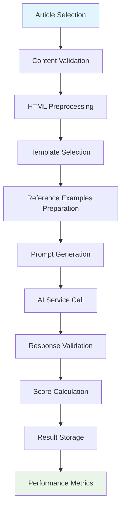
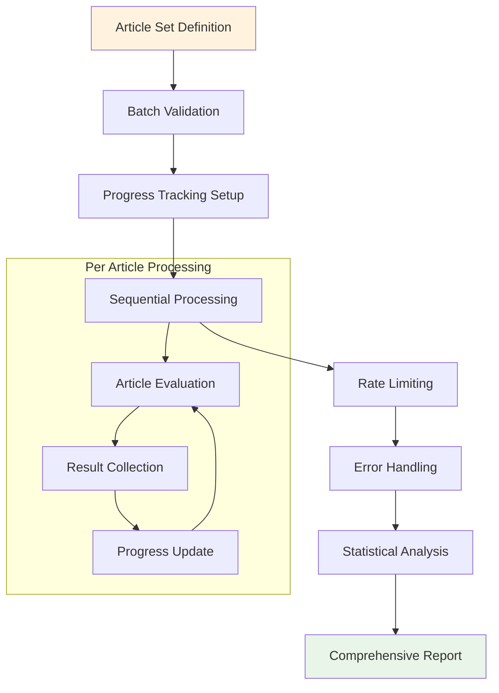
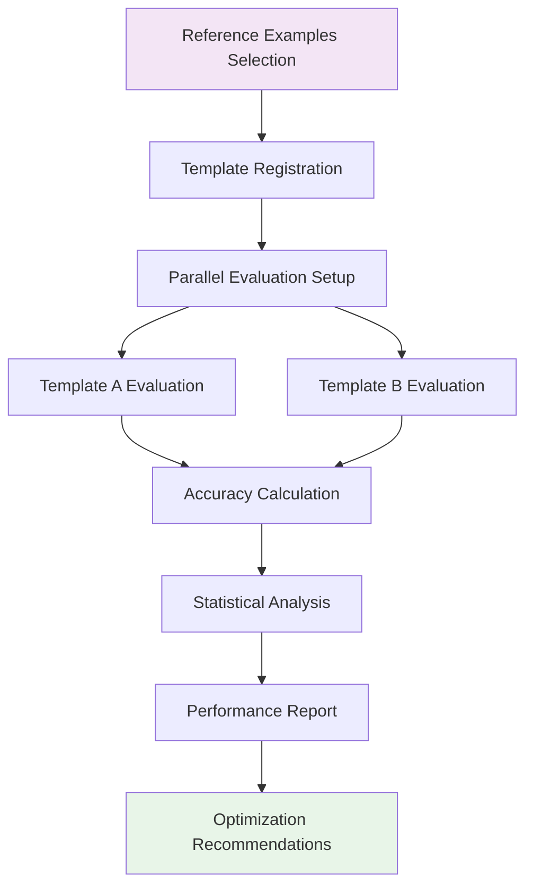
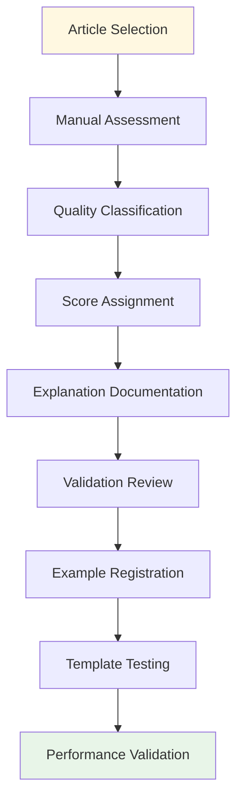
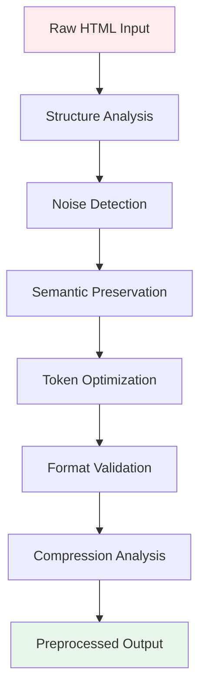
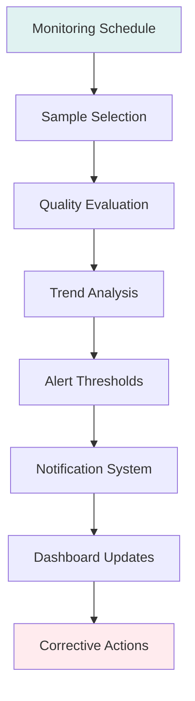

# Process Workflows

> **End-to-end processes and operational procedures for content quality assessment**

## Overview

The Content Quality Assessment System operates through several well-defined workflows that ensure consistent, reliable, and cost-effective quality evaluation. Each workflow addresses specific operational needs while maintaining system integrity and performance.

## Core Workflows

### 1. Single Article Quality Evaluation

**Purpose**: Evaluate the extraction quality of a single article
**Triggers**: Manual evaluation, debugging, quality spot-checks
**Duration**: ~23 seconds per article (with rate limiting)



#### Detailed Steps

1. **Article Selection & Validation**
   ```bash
   # Command usage
   ./docker.sh django evaluate_quality --article-id abc123-def456
   ```
   - Validate article exists and has required content
   - Check extraction status (must be 'completed')
   - Verify content blocks are available

2. **Content Preparation Pipeline**
   ```python
   # Content preparation process
   extracted_content = evaluator._prepare_extracted_content(article)
   html_sample = evaluator._prepare_html_sample(article, use_preprocessing=True)
   reference_examples = evaluator._prepare_reference_examples(max_per_class=1)
   ```

3. **HTML Preprocessing**
   - Structure preservation with semantic tags
   - Noise removal (scripts, styles, navigation)
   - Token optimization for LLM context
   - Compression analysis and reporting

4. **Template-Based Prompt Generation**
   - Template selection (default: comprehensive_quality_evaluation_v3.1)
   - Variable substitution with prepared content
   - Few-shot example integration
   - Token count validation

5. **AI Service Interaction**
   - Model selection (gpt-4o-mini default)
   - Rate limiting and retry logic
   - Response format validation (JSON)
   - Cost tracking and token usage

6. **Result Processing**
   - JSON response parsing
   - Domain score calculation (programmatic overall score)
   - Quality classification assignment
   - Database persistence

#### Success Criteria
- ✅ All four dimension scores in valid range (0-1)
- ✅ Overall score calculated using domain formula (-1 to +1)
- ✅ Confidence score above 0.5
- ✅ Processing time under 30 seconds
- ✅ Successful database persistence

---

### 2. Batch Article Evaluation

**Purpose**: Evaluate multiple articles efficiently with comprehensive statistics
**Triggers**: Quality monitoring, content pipeline assessment, batch analysis
**Duration**: ~23 seconds per article + batch overhead



#### Command Usage

```bash
# Evaluate specific articles by ID
./docker.sh django evaluate_batch_by_ids \
  --ids "15999,15997,15996,15994,15989" \
  --model gpt-4o-mini \
  --delay 2 \
  --verbose

# Evaluate recent articles
./docker.sh django evaluate_quality \
  --limit 20 \
  --model gpt-4o-mini \
  --recent
```

#### Batch Processing Features

1. **Rate Limiting Management**
   - Configurable delays between requests (default: 2 seconds)
   - Automatic backoff on rate limit errors
   - Progress preservation on interruption

2. **Error Resilience**
   - Individual article failure doesn't stop batch
   - Comprehensive error logging
   - Graceful degradation with partial results

3. **Statistical Analysis**
   ```
   Quality Distribution:
   ├── Excellent (≥0.8): 1 article  (5%)
   ├── Good (0.5-0.8):   1 article  (5%)  
   ├── Fair (0.2-0.5):   0 articles (0%)
   ├── Poor (-0.2-0.2):  4 articles (20%)
   └── Failed (<-0.2):   14 articles (70%)
   
   Average Scores:
   ├── Overall: -0.342
   ├── Completeness: 0.325
   ├── Purity: 0.255
   ├── Structure: 0.380
   └── Readability: 0.443
   ```

4. **Cost Analysis**
   - Total token usage tracking
   - Per-article cost calculation
   - Model efficiency metrics

---

### 3. Template Comparison Workflow

**Purpose**: A/B test different prompt templates to optimize evaluation accuracy
**Triggers**: Template development, accuracy optimization, performance analysis
**Duration**: Variable based on example count and rate limits



#### Template Comparison Process

1. **Reference Example Preparation**
   ```python
   # Quality class distribution for testing
   examples_per_class = {
       'perfect': 1,    # Highest quality extractions
       'good': 3,       # High quality with minor issues
       'imperfect': 6,  # Medium quality with problems
       'awful': 2       # Poor quality extractions
   }
   ```

2. **Parallel Template Evaluation**
   ```bash
   # Compare specific templates
   ./docker.sh django compare_templates \
     --templates comprehensive_quality_evaluation_v3.1,structured_rubric_evaluation_v2025-05-v3 \
     --quality-class good \
     --verbose
   
   # Compare all available templates
   ./docker.sh django compare_templates --by-class
   ```

3. **Accuracy Metrics Calculation**
   - **Mean Absolute Error (MAE)** for each dimension
   - **Total MAE** across all dimensions
   - **Class-specific performance** analysis
   - **Statistical significance** testing

4. **Performance Analysis Framework**
   ```python
   # Accuracy calculation for each template
   accuracy_metrics = {
       'completeness_mae': abs(actual.completeness - expected.completeness),
       'purity_mae': abs(actual.purity - expected.purity),
       'structure_mae': abs(actual.structure - expected.structure),
       'readability_mae': abs(actual.readability - expected.readability),
       'overall_mae': abs(actual.overall_score - expected.overall_score),
       'total_mae': sum(all_maes) / 5
   }
   ```

#### Recent Template Performance Results

**Best Template by Quality Class:**
- **Good Quality Content**: `comprehensive_quality_evaluation_v3.1` (MAE: 0.005)
- **Poor Quality Content**: `structured_rubric_evaluation_v2025-05-v3` (MAE: 0.000)

**Template Characteristics:**
- **Comprehensive**: Better at nuanced scoring, faster evaluation
- **Structured Rubric**: Excellent at extreme classifications, decisive scoring

---

### 4. Reference Example Curation Workflow

**Purpose**: Maintain high-quality ground truth examples for few-shot learning
**Triggers**: Template optimization, accuracy improvement, example expansion
**Duration**: Manual curation + validation time



#### Curation Process

1. **Article Selection Criteria**
   - Diverse content types (news, blogs, technical articles)
   - Various quality levels (excellent to poor)
   - Different extraction challenges
   - Representative domain coverage

2. **Quality Assessment Guidelines**
   ```python
   quality_classes = {
       'perfect': 0.90-1.00,    # Exceptional extraction quality
       'good': 0.70-0.89,       # High quality with minor issues
       'imperfect': 0.30-0.69,  # Moderate quality, needs improvement
       'awful': 0.00-0.29       # Poor quality, significant problems
   }
   ```

3. **Documentation Requirements**
   - Detailed explanation of quality assessment
   - Specific missing elements identification
   - Noise patterns and contamination sources
   - Key strengths and improvement areas

4. **Validation and Testing**
   - Cross-validator review for consistency
   - Template performance impact testing
   - Statistical significance validation

---

### 5. HTML Preprocessing Workflow

**Purpose**: Optimize HTML content for accurate quality evaluation
**Triggers**: Before every evaluation, large content handling
**Duration**: ~1-2 seconds per article



#### Preprocessing Steps

1. **Structure Analysis**
   ```python
   # Parse with structure preservation
   soup = BeautifulSoup(html_content, 'lxml')
   
   # Preserve semantic HTML tags
   preserved_tags = {
       'div', 'section', 'article', 'main', 'header', 'footer',
       'h1', 'h2', 'h3', 'h4', 'h5', 'h6',
       'p', 'span', 'a', 'img', 'ul', 'ol', 'li'
   }
   ```

2. **Noise Removal**
   - Scripts and stylesheets removal
   - Navigation and menu cleanup
   - Advertisement content filtering
   - Comment section removal

3. **Token Optimization**
   - Content density analysis
   - Intelligent truncation for large articles
   - Key content preservation
   - Context window management

4. **Quality Metrics**
   ```python
   preprocessing_result = {
       'original_size': len(raw_html),
       'cleaned_size': len(cleaned_html),
       'compression_ratio': 1 - (cleaned_size / original_size),
       'processing_method': 'structure_preserving',
       'preserved_structure': True
   }
   ```

#### Performance Characteristics
- **Compression Ratio**: 71-77% size reduction typical
- **Processing Time**: 1-2 seconds per article
- **Structure Preservation**: Semantic HTML maintained
- **Token Efficiency**: Optimized for LLM context windows

---

### 6. Quality Monitoring Workflow

**Purpose**: Continuous monitoring of content extraction pipeline quality
**Triggers**: Scheduled runs, quality alerts, performance degradation
**Duration**: Depends on monitoring scope



#### Monitoring Metrics

1. **Quality Distribution Tracking**
   - Percentage of articles by quality class
   - Average scores across dimensions
   - Quality degradation detection

2. **Performance Indicators**
   - Processing time trends
   - Error rate monitoring
   - Cost efficiency tracking

3. **Alert Thresholds**
   ```python
   alert_thresholds = {
       'failed_percentage': 0.50,     # >50% failed articles
       'average_overall_score': 0.0,  # Below neutral quality
       'processing_errors': 0.10,     # >10% error rate
       'cost_per_evaluation': 0.02    # >$0.02 per evaluation
   }
   ```

---

## Operational Procedures

### Daily Quality Checks

1. **Morning Quality Review**
   ```bash
   # Check recent article quality
   ./docker.sh django evaluate_quality --limit 10 --recent
   ```

2. **Weekly Template Performance**
   ```bash
   # Compare template accuracy
   ./docker.sh django compare_templates --by-class
   ```

3. **Monthly Reference Curation**
   - Review and update reference examples
   - Add new quality classes if needed
   - Validate example accuracy

### Troubleshooting Workflows

1. **Low Quality Score Investigation**
   - Check specific failed articles
   - Analyze extraction patterns
   - Identify systematic issues

2. **Template Performance Issues**
   - Run template comparison
   - Analyze accuracy metrics
   - Consider template optimization

3. **Rate Limiting Management**
   - Monitor API usage patterns
   - Adjust delays and batch sizes
   - Implement fallback strategies

---

## Integration Points

### With Content Processing Pipeline
- Quality scores feed back to extraction optimization
- Poor quality articles flagged for reprocessing
- Quality metrics inform extraction algorithm improvements

### With Monitoring Systems
- Quality alerts integrated with system monitoring
- Performance metrics exported to dashboards
- Cost tracking integrated with budget management

### With Development Workflow
- Template changes validated through comparison framework
- Reference examples updated with new content types
- Performance regressions detected through automated testing

---

## Related Documentation

- **[Architecture Overview](./architecture.md)** - System design and components
- **[Implementation Guide](./implementation.md)** - Technical implementation details
- **[Command Reference](./commands.md)** - Management command documentation 