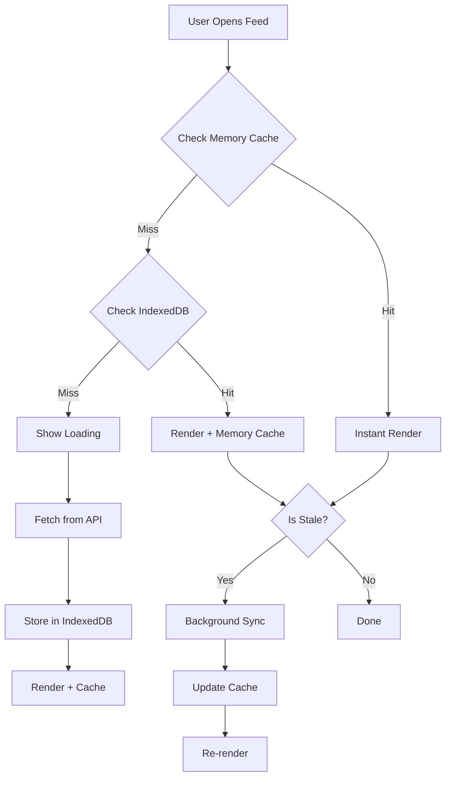
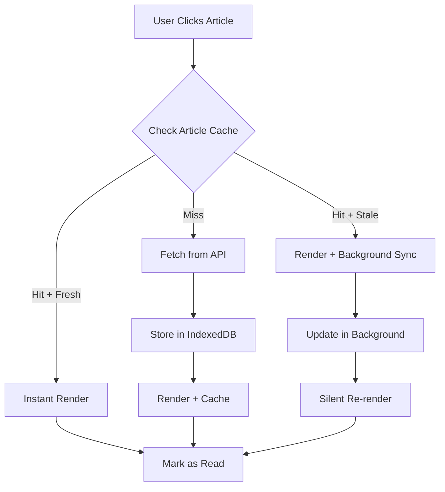
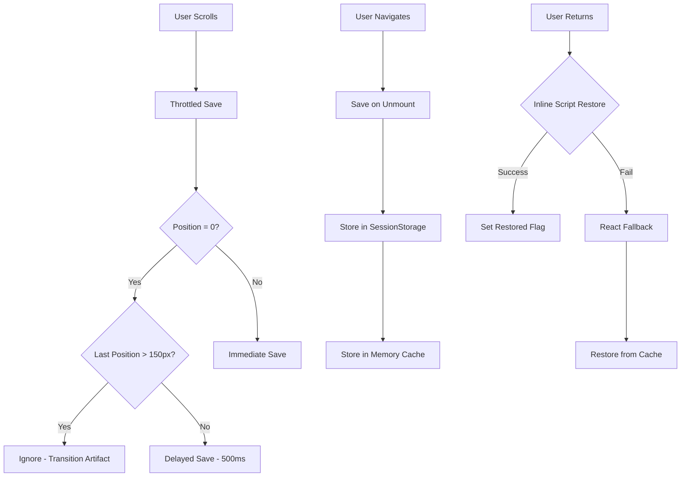

# Local Storage Architecture

## Overview

The DailyBrief local storage system is built on a **local-first architecture** that prioritizes instant user experience through intelligent caching, progressive data loading, and seamless offline functionality.

## 🏗️ System Design Principles

### 1. Local-First Strategy
- **Cache First**: Always serve from local storage when available
- **Background Sync**: Update cache without blocking UI
- **Optimistic Updates**: Immediate UI response with eventual consistency
- **Graceful Degradation**: Full functionality even when offline

### 2. Progressive Enhancement
- **Instant Rendering**: Show cached content immediately
- **Incremental Loading**: Load additional pages on demand
- **Smart Prefetching**: Anticipate user needs
- **Seamless Transitions**: No loading states between cached content

### 3. Mobile-First Design
- **Touch Interactions**: Pull-to-refresh, infinite scroll
- **Performance**: Optimized for mobile hardware constraints
- **Battery Efficiency**: Minimal background processing
- **Data Conservation**: Intelligent sync strategies

## 🔧 Core Components

### Data Manager (`data-manager.ts`)
**Role**: Central orchestration layer for all data operations

```typescript
interface DataManagerConfig {
  userPreferencesMaxAge: number    // 30 minutes
  feedMaxAge: number              // 10 minutes  
  articleDetailMaxAge: number     // 1 hour
  enableBackgroundSync: boolean   // true
  maxConcurrentSyncs: number     // 3
}
```

**Responsibilities**:
- **Local-first data access**: Check cache before network
- **Sync orchestration**: Manage background updates
- **Staleness management**: Time-based cache invalidation
- **Error recovery**: Handle network and storage failures
- **Concurrency control**: Prevent duplicate requests

### Local Database (`local-database.ts`)
**Role**: Persistent storage layer using IndexedDB

```typescript
// Core data models
interface LocalUserProfile { ... }    // User preferences & settings
interface LocalArticle { ... }        // Article content & metadata
interface FeedSync { ... }            // Feed synchronization state
interface FeedItem { ... }            // Feed-article relationships
```

**Responsibilities**:
- **Data persistence**: Store articles, feeds, user data
- **Relationship management**: Link feeds to articles
- **Schema versioning**: Handle database migrations
- **Query optimization**: Efficient data retrieval
- **Automatic timestamps**: Track creation/update times

### Storage Manager (`storage-manager.ts`)
**Role**: Storage health and lifecycle management

**Responsibilities**:
- **Quota monitoring**: Track storage usage (85% threshold)
- **Automatic cleanup**: Remove old data (30+ days)
- **Health checks**: Monitor storage availability
- **Error recovery**: Handle quota exceeded scenarios
- **Emergency clear**: Complete data reset capability

### React Hooks (`use-local-data.ts`)
**Role**: React integration layer providing reactive data access

```typescript
// Primary hooks for component consumption
useFeed(feedType, topicSlug, searchQuery, sortOrder, options)
useArticleDetail(articleId, options)
useUserPreferences(options)
useOfflineStatus()
useBackgroundSync(interval)
```

**Responsibilities**:
- **Reactive data binding**: Automatic UI updates
- **State persistence**: Maintain state across unmounts
- **Loading orchestration**: Coordinate sync operations
- **Error boundaries**: Graceful error handling
- **Cache management**: In-memory state caching

## 🔄 Data Flow Architecture

### 1. Feed Data Flow



### 2. Article Data Flow



### 3. Scroll Position Flow



## 🧠 Caching Strategy

### Three-Tier Cache Architecture

```
┌─────────────────────────────────────────────────────────┐
│                    Memory Cache                         │
│  • HookStateCache (5min TTL)                          │
│  • Component state persistence                         │
│  • Instant access for active sessions                  │
└─────────────────────────────────────────────────────────┘
                            │
                            ▼
┌─────────────────────────────────────────────────────────┐
│                 SessionStorage                          │
│  • Scroll positions                                    │
│  • UI state restoration                                │
│  • Cross-tab synchronization                           │
└─────────────────────────────────────────────────────────┘
                            │
                            ▼
┌─────────────────────────────────────────────────────────┐
│                  IndexedDB (Dexie)                     │
│  • Articles, feeds, user data                          │
│  • Persistent across sessions                          │
│  • Structured queries and relationships                │
└─────────────────────────────────────────────────────────┘
```

### Cache Invalidation Strategy

| Data Type | Max Age | Invalidation Trigger | Background Sync |
|-----------|---------|---------------------|-----------------|
| **User Preferences** | 30 min | Settings change, explicit refresh | ✅ Every 30 min |
| **Feed Data** | 10 min | Manual refresh, app focus | ✅ Every 10 min |
| **Article Content** | 1 hour | Manual refresh, edit action | ✅ When accessed if stale |
| **UI State (Memory)** | 5 min | Component unmount, tab switch | ❌ Session-based |
| **Scroll Positions** | Session | Navigation, manual clear | ❌ Session-based |

## 🔧 Component Interaction Patterns

### 1. Hook to Data Manager Communication

```typescript
// Hook requests data with local-first strategy
const result = await dataManager.getFeed(
  'personalized', 
  undefined, 
  1, 
  10, 
  { backgroundSync: true }
)

// Data Manager checks cache hierarchy:
// 1. Return cached data immediately if available
// 2. Trigger background sync if stale
// 3. Return null if no cache + network fetch required
```

### 2. Storage Manager Integration

```typescript
// Automatic storage health monitoring
setInterval(async () => {
  const isHealthy = await storageManager.isStorageHealthy()
  if (!isHealthy) {
    await storageManager.cleanupOldData()
  }
}, 10 * 60 * 1000)

// Error recovery on quota exceeded
catch (error) {
  if (error.name === 'QuotaExceededError') {
    await storageManager.cleanupOldData()
    // Retry operation
  }
}
```

### 3. Background Sync Coordination

```typescript
// Non-blocking sync with debouncing
private queueBackgroundSync(key: string, syncFn: () => Promise<void>) {
  if (this.syncQueue.has(key)) return // Prevent duplicates
  
  this.syncQueue.add(key)
  setTimeout(async () => {
    try {
      await syncFn()
    } finally {
      this.syncQueue.delete(key)
    }
  }, this.SYNC_DEBOUNCE_MS)
}
```

## 🏛️ Database Schema Design

### Entity Relationship Diagram

```
┌─────────────────┐    ┌─────────────────┐    ┌─────────────────┐
│  UserProfile    │    │    FeedSync     │    │   FeedItem      │
│                 │    │                 │    │                 │
│ • userId (PK)   │───▶│ • userId (FK)   │───▶│ • feedSyncId    │
│ • publicId      │    │ • feedType      │    │ • articleId     │
│ • preferences   │    │ • topicSlug     │    │ • position      │
│ • lastSyncAt    │    │ • lastSyncAt    │    │ • addedAt       │
└─────────────────┘    │ • hasMore       │    └─────────────────┘
                       │ • isStale       │             │
                       └─────────────────┘             │
                                                       │
                       ┌─────────────────┐             │
                       │   LocalArticle  │◀────────────┘
                       │                 │
                       │ • backendId     │
                       │ • title         │
                       │ • content       │
                       │ • publishedAt   │
                       │ • isRead        │
                       │ • isSaved       │
                       └─────────────────┘
```

### Index Strategy

```typescript
// Optimized indexes for common query patterns
{
  userProfiles: '++id, userId, publicId, lastSyncAt',
  articles: '++id, backendId, publishedAt, isTopHeadline, isRead, isSaved, lastSyncAt',
  feedSyncs: '++id, userId, feedType, lastSyncAt, nextSyncAt, isStale',
  feedItems: '++id, feedSyncId, articleId, position, addedAt'
}

// Compound queries supported:
// • Articles by read status and date
// • Feed items by sync and position
// • User feeds by type and staleness
```

## 🔄 Sync Strategies

### 1. Immediate Sync (Blocking)
- **When**: No local data available
- **Behavior**: Show loading, fetch from API, cache result
- **Use Cases**: First app load, cache miss, explicit refresh

### 2. Background Sync (Non-blocking)
- **When**: Stale data available
- **Behavior**: Show cached data, update in background
- **Use Cases**: Subsequent loads, periodic updates

### 3. Optimistic Updates
- **When**: User interactions (mark read, save article)
- **Behavior**: Update UI immediately, sync to backend
- **Use Cases**: Read status, bookmarks, preferences

### 4. Periodic Refresh
- **When**: App in background, scheduled intervals
- **Behavior**: Silent updates when app regains focus
- **Use Cases**: Background sync, app lifecycle events

## 🛡️ Error Handling Strategy

### 1. Storage Errors
```typescript
// Graceful degradation for storage issues
try {
  await localDB.articles.add(article)
} catch (error) {
  if (error.name === 'QuotaExceededError') {
    await emergencyCleanup()
    await retryOperation()
  } else {
    fallbackToMemoryCache()
  }
}
```

### 2. Network Errors
```typescript
// Offline-first with graceful fallback
try {
  const data = await fetchFromAPI()
  await cacheData(data)
  return data
} catch (networkError) {
  const cachedData = await getCachedData()
  if (cachedData) {
    return cachedData // Serve stale content
  }
  throw new OfflineError('No cached data available')
}
```

### 3. Sync Conflicts
```typescript
// Last-write-wins with conflict detection
const serverData = await fetchLatest()
const localData = await getLocalData()

if (serverData.updatedAt > localData.lastSyncAt) {
  await mergeData(serverData, localData)
} else {
  await uploadLocalChanges(localData)
}
```

## 📊 Performance Considerations

### Memory Management
- **Hook State Cache**: 5-minute TTL to prevent memory leaks
- **Component Cleanup**: Automatic cleanup on unmount
- **Lazy Loading**: Load article content on demand
- **Selective Caching**: Only cache frequently accessed data

### Storage Optimization
- **Automatic Cleanup**: Remove data older than 30 days
- **Quota Management**: Monitor and maintain under 85% usage
- **Compression**: JSON string storage for complex data
- **Index Efficiency**: Optimized queries for common patterns

### Network Efficiency
- **Request Deduplication**: Prevent concurrent identical requests
- **Background Sync**: Non-blocking updates
- **Selective Sync**: Only update changed data
- **Connection Awareness**: Adapt behavior based on network state

## 🔮 Future Considerations

### Scalability
- **Multi-user Support**: Isolated user data storage
- **Shared Article Cache**: Deduplicate common articles
- **Sync Batching**: Bulk operations for efficiency
- **Progressive Web Workers**: Background sync processing

### Advanced Features
- **Conflict Resolution**: More sophisticated merge strategies
- **Predictive Caching**: ML-based prefetching
- **Real-time Sync**: WebSocket integration
- **Cross-device Sync**: Cloud synchronization layer 