# Local Storage Data Flows

## Overview

This document outlines the data flows and user interaction patterns within the DailyBrief local storage system, covering both happy path scenarios and edge cases.

## 🔄 Core Data Flows

### 1. Application Bootstrap Flow

The initial app load sequence establishing local storage foundation.

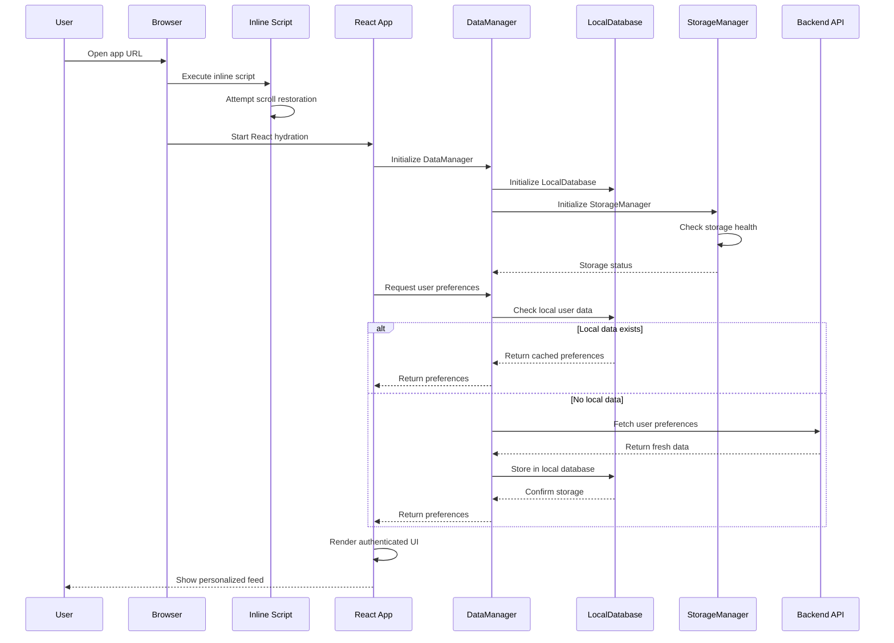
```mermaid
sequenceDiagram
    participant U as User
    participant B as Browser
    participant I as Inline Script
    participant R as React App
    participant DM as DataManager
    participant DB as LocalDatabase
    participant SM as StorageManager
    participant API as Backend API
    
    U->>B: Open app URL
    B->>I: Execute inline script
    I->>I: Attempt scroll restoration
    B->>R: Start React hydration
    
    R->>DM: Initialize DataManager
    DM->>DB: Initialize LocalDatabase
    DM->>SM: Initialize StorageManager
    
    SM->>SM: Check storage health
    SM-->>DM: Storage status
    
    R->>DM: Request user preferences
    DM->>DB: Check local user data
    
    alt Local data exists
        DB-->>DM: Return cached preferences
        DM-->>R: Return preferences
    else No local data
        DM->>API: Fetch user preferences
        API-->>DM: Return fresh data
        DM->>DB: Store in local database
        DB-->>DM: Confirm storage
        DM-->>R: Return preferences
    end
    
    R->>R: Render authenticated UI
    R-->>U: Show personalized feed
```

### 2. Feed Loading Flow

The local-first feed loading pattern with background sync.

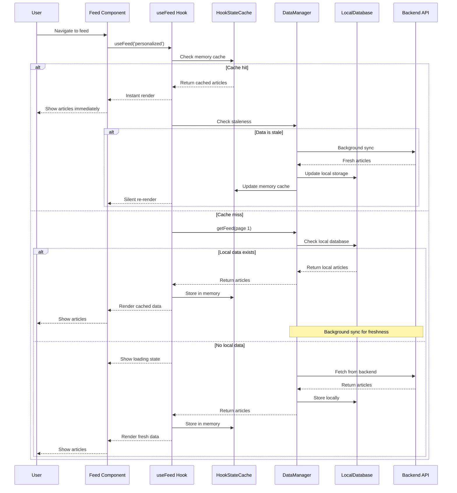
```mermaid
sequenceDiagram
    participant U as User
    participant Feed as Feed Component
    participant Hook as useFeed Hook
    participant Cache as HookStateCache
    participant DM as DataManager
    participant DB as LocalDatabase
    participant API as Backend API
    
    U->>Feed: Navigate to feed
    Feed->>Hook: useFeed('personalized')
    
    Hook->>Cache: Check memory cache
    alt Cache hit
        Cache-->>Hook: Return cached articles
        Hook-->>Feed: Instant render
        Feed-->>U: Show articles immediately
        
        Hook->>DM: Check staleness
        alt Data is stale
            DM->>API: Background sync
            API-->>DM: Fresh articles
            DM->>DB: Update local storage
            DM->>Cache: Update memory cache
            Hook-->>Feed: Silent re-render
        end
    else Cache miss
        Hook->>DM: getFeed(page 1)
        DM->>DB: Check local database
        
        alt Local data exists
            DB-->>DM: Return local articles
            DM-->>Hook: Return articles
            Hook->>Cache: Store in memory
            Hook-->>Feed: Render cached data
            Feed-->>U: Show articles
            
            Note over DM,API: Background sync for freshness
        else No local data
            Hook-->>Feed: Show loading state
            DM->>API: Fetch from backend
            API-->>DM: Return articles
            DM->>DB: Store locally
            DM-->>Hook: Return articles
            Hook->>Cache: Store in memory
            Hook-->>Feed: Render fresh data
            Feed-->>U: Show articles
        end
    end
```

### 3. Infinite Scroll Flow

Page-by-page loading with local caching.

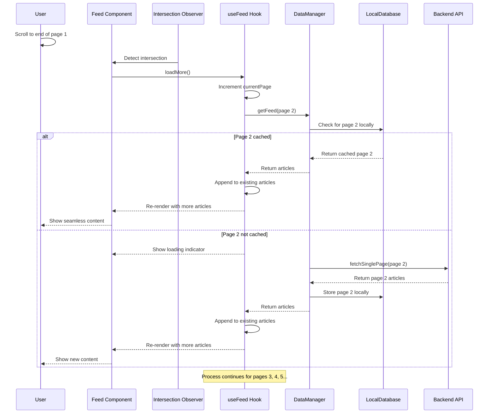
```mermaid
sequenceDiagram
    participant U as User
    participant Feed as Feed Component
    participant IO as Intersection Observer
    participant Hook as useFeed Hook
    participant DM as DataManager
    participant DB as LocalDatabase
    participant API as Backend API
    
    U->>U: Scroll to end of page 1
    IO->>Feed: Detect intersection
    Feed->>Hook: loadMore()
    Hook->>Hook: Increment currentPage
    
    Hook->>DM: getFeed(page 2)
    DM->>DB: Check for page 2 locally
    
    alt Page 2 cached
        DB-->>DM: Return cached page 2
        DM-->>Hook: Return articles
        Hook->>Hook: Append to existing articles
        Hook-->>Feed: Re-render with more articles
        Feed-->>U: Show seamless content
        
    else Page 2 not cached
        Hook-->>Feed: Show loading indicator
        DM->>API: fetchSinglePage(page 2)
        API-->>DM: Return page 2 articles
        DM->>DB: Store page 2 locally
        DM-->>Hook: Return articles
        Hook->>Hook: Append to existing articles
        Hook-->>Feed: Re-render with more articles
        Feed-->>U: Show new content
    end
    
    Note over Hook: Process continues for pages 3, 4, 5...
```

### 4. Article Detail Flow

Article content loading with smart caching.

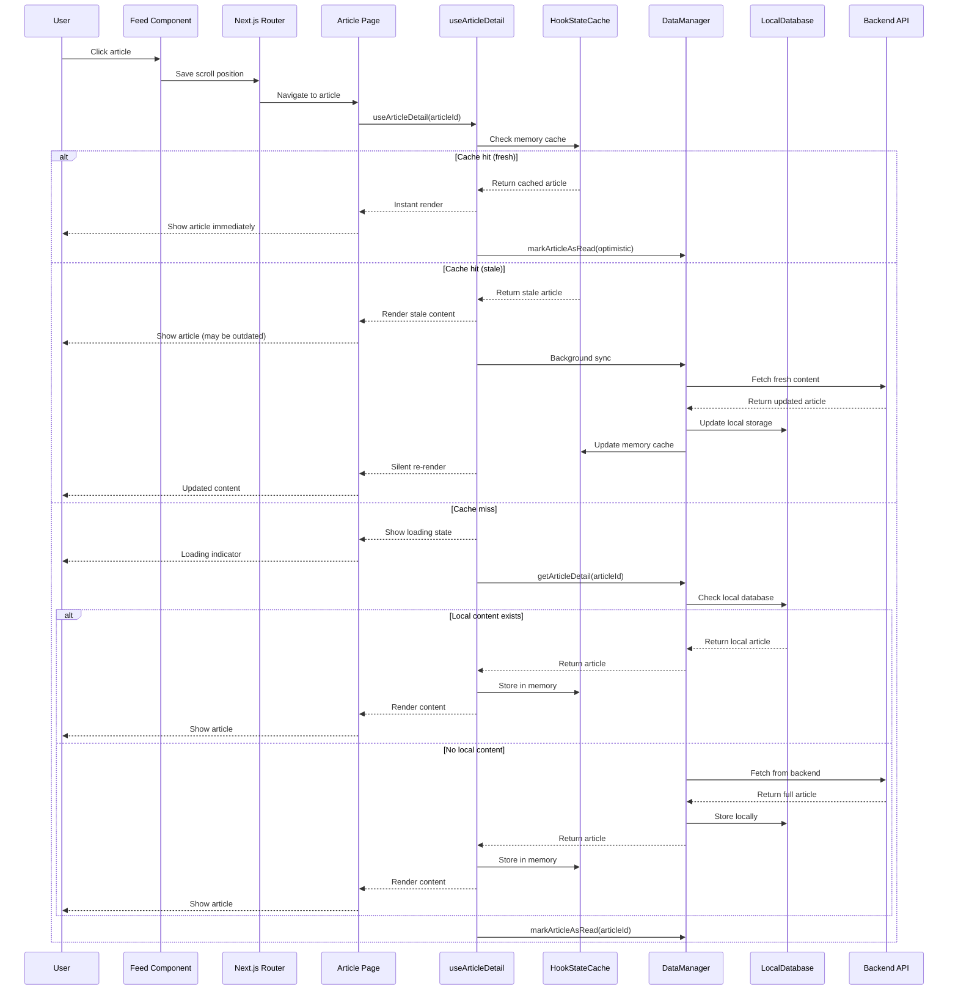
```mermaid
sequenceDiagram
    participant U as User
    participant Feed as Feed Component
    participant Router as Next.js Router
    participant Article as Article Page
    participant Hook as useArticleDetail
    participant Cache as HookStateCache
    participant DM as DataManager
    participant DB as LocalDatabase
    participant API as Backend API
    
    U->>Feed: Click article
    Feed->>Router: Save scroll position
    Router->>Article: Navigate to article
    Article->>Hook: useArticleDetail(articleId)
    
    Hook->>Cache: Check memory cache
    alt Cache hit (fresh)
        Cache-->>Hook: Return cached article
        Hook-->>Article: Instant render
        Article-->>U: Show article immediately
        Hook->>DM: markArticleAsRead(optimistic)
        
    else Cache hit (stale)
        Cache-->>Hook: Return stale article
        Hook-->>Article: Render stale content
        Article-->>U: Show article (may be outdated)
        
        Hook->>DM: Background sync
        DM->>API: Fetch fresh content
        API-->>DM: Return updated article
        DM->>DB: Update local storage
        DM->>Cache: Update memory cache
        Hook-->>Article: Silent re-render
        Article-->>U: Updated content
        
    else Cache miss
        Hook-->>Article: Show loading state
        Article-->>U: Loading indicator
        
        Hook->>DM: getArticleDetail(articleId)
        DM->>DB: Check local database
        
        alt Local content exists
            DB-->>DM: Return local article
            DM-->>Hook: Return article
            Hook->>Cache: Store in memory
            Hook-->>Article: Render content
            Article-->>U: Show article
            
        else No local content
            DM->>API: Fetch from backend
            API-->>DM: Return full article
            DM->>DB: Store locally
            DM-->>Hook: Return article
            Hook->>Cache: Store in memory
            Hook-->>Article: Render content
            Article-->>U: Show article
        end
        
        Hook->>DM: markArticleAsRead(articleId)
    end
```

### 5. Scroll Position Restoration Flow

Multi-layer scroll restoration across navigation.

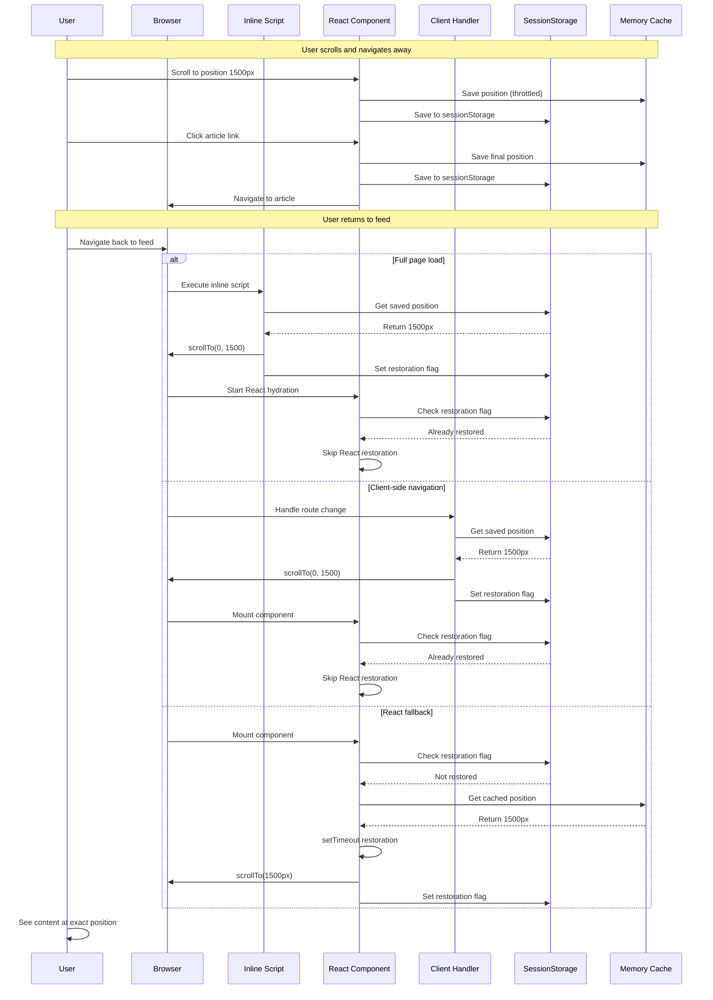
```mermaid
sequenceDiagram
    participant U as User
    participant B as Browser
    participant I as Inline Script
    participant R as React Component
    participant C as Client Handler
    participant S as SessionStorage
    participant M as Memory Cache
    
    Note over U,M: User scrolls and navigates away
    U->>R: Scroll to position 1500px
    R->>M: Save position (throttled)
    R->>S: Save to sessionStorage
    
    U->>R: Click article link
    R->>M: Save final position
    R->>S: Save to sessionStorage
    R->>B: Navigate to article
    
    Note over U,M: User returns to feed
    U->>B: Navigate back to feed
    
    alt Full page load
        B->>I: Execute inline script
        I->>S: Get saved position
        S-->>I: Return 1500px
        I->>B: scrollTo(0, 1500)
        I->>S: Set restoration flag
        B->>R: Start React hydration
        R->>S: Check restoration flag
        S-->>R: Already restored
        R->>R: Skip React restoration
        
    else Client-side navigation
        B->>C: Handle route change
        C->>S: Get saved position
        S-->>C: Return 1500px
        C->>B: scrollTo(0, 1500)
        C->>S: Set restoration flag
        B->>R: Mount component
        R->>S: Check restoration flag
        S-->>R: Already restored
        R->>R: Skip React restoration
        
    else React fallback
        B->>R: Mount component
        R->>S: Check restoration flag
        S-->>R: Not restored
        R->>M: Get cached position
        M-->>R: Return 1500px
        R->>R: setTimeout restoration
        R->>B: scrollTo(1500px)
        R->>S: Set restoration flag
    end
    
    U->>U: See content at exact position
```

## 👤 User Interaction Patterns

### 1. First-Time User Journey

New user onboarding with progressive data loading.

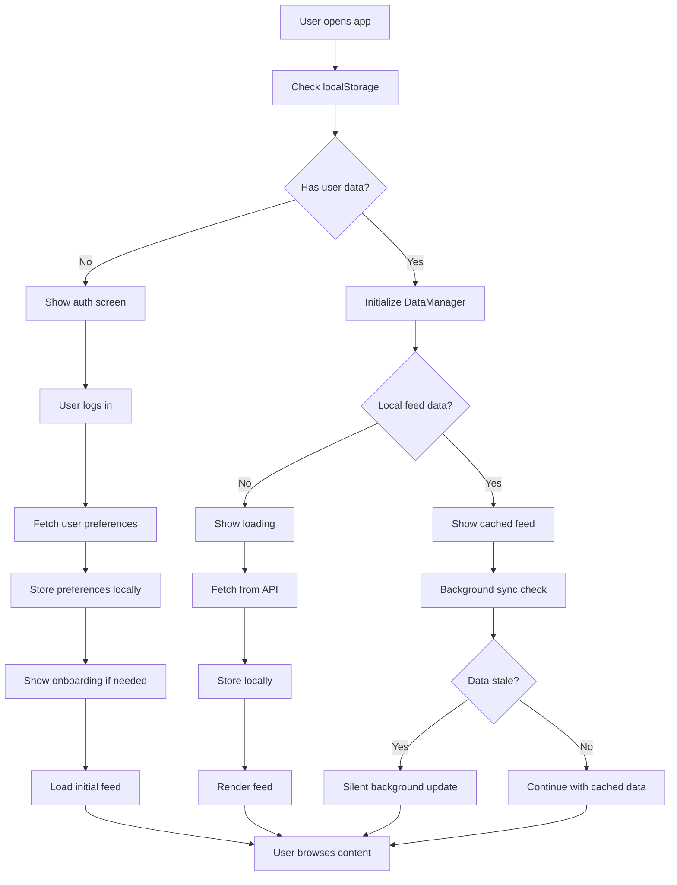
```mermaid
flowchart TD
    A[User opens app] --> B[Check localStorage]
    B --> C{Has user data?}
    C -->|No| D[Show auth screen]
    C -->|Yes| E[Initialize DataManager]
    
    D --> F[User logs in]
    F --> G[Fetch user preferences]
    G --> H[Store preferences locally]
    H --> I[Show onboarding if needed]
    I --> J[Load initial feed]
    
    E --> K{Local feed data?}
    K -->|No| L[Show loading]
    K -->|Yes| M[Show cached feed]
    
    L --> N[Fetch from API]
    N --> O[Store locally]
    O --> P[Render feed]
    
    M --> Q[Background sync check]
    Q --> R{Data stale?}
    R -->|Yes| S[Silent background update]
    R -->|No| T[Continue with cached data]
    
    J --> U[User browses content]
    P --> U
    S --> U
    T --> U
```

### 2. Returning User Journey

Optimized experience for returning users.

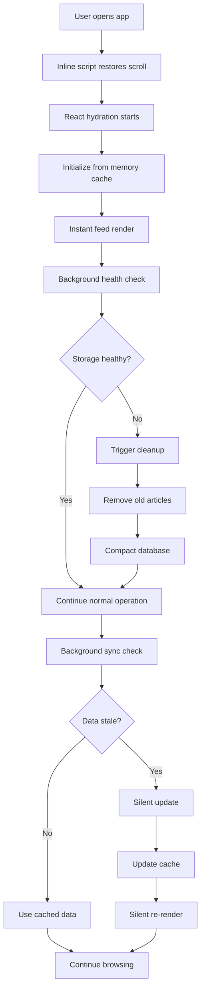
```mermaid
flowchart TD
    A[User opens app] --> B[Inline script restores scroll]
    B --> C[React hydration starts]
    C --> D[Initialize from memory cache]
    D --> E[Instant feed render]
    E --> F[Background health check]
    
    F --> G{Storage healthy?}
    G -->|Yes| H[Continue normal operation]
    G -->|No| I[Trigger cleanup]
    
    I --> J[Remove old articles]
    J --> K[Compact database]
    K --> H
    
    H --> L[Background sync check]
    L --> M{Data stale?}
    M -->|Yes| N[Silent update]
    M -->|No| O[Use cached data]
    
    N --> P[Update cache]
    P --> Q[Silent re-render]
    O --> R[Continue browsing]
    Q --> R
```

### 3. Offline-to-Online Transition

Handling network state changes gracefully.

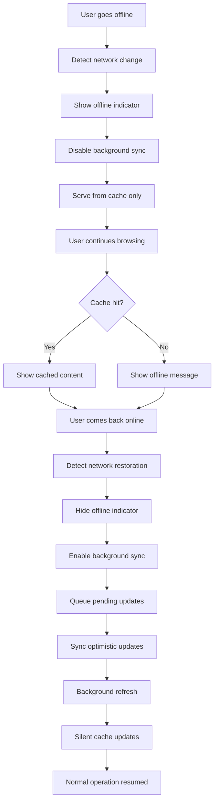
```mermaid
flowchart TD
    A[User goes offline] --> B[Detect network change]
    B --> C[Show offline indicator]
    C --> D[Disable background sync]
    D --> E[Serve from cache only]
    
    E --> F[User continues browsing]
    F --> G{Cache hit?}
    G -->|Yes| H[Show cached content]
    G -->|No| I[Show offline message]
    
    H --> J[User comes back online]
    I --> J
    J --> K[Detect network restoration]
    K --> L[Hide offline indicator]
    L --> M[Enable background sync]
    M --> N[Queue pending updates]
    N --> O[Sync optimistic updates]
    O --> P[Background refresh]
    P --> Q[Silent cache updates]
    Q --> R[Normal operation resumed]
```

### 4. Tab Switching Flow

Seamless navigation between feed tabs.

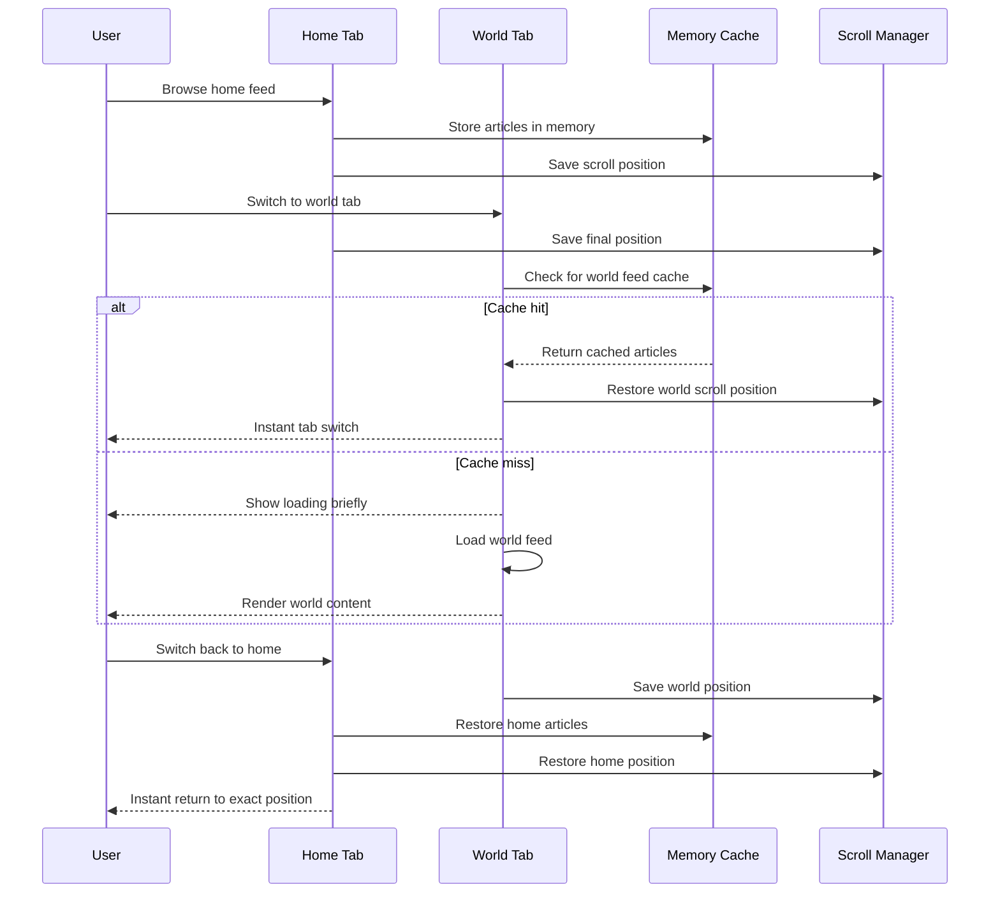
```mermaid
sequenceDiagram
    participant U as User
    participant H as Home Tab
    participant W as World Tab
    participant Cache as Memory Cache
    participant Scroll as Scroll Manager
    
    U->>H: Browse home feed
    H->>Cache: Store articles in memory
    H->>Scroll: Save scroll position
    
    U->>W: Switch to world tab
    H->>Scroll: Save final position
    W->>Cache: Check for world feed cache
    
    alt Cache hit
        Cache-->>W: Return cached articles
        W->>Scroll: Restore world scroll position
        W-->>U: Instant tab switch
    else Cache miss
        W-->>U: Show loading briefly
        W->>W: Load world feed
        W-->>U: Render world content
    end
    
    U->>H: Switch back to home
    W->>Scroll: Save world position
    H->>Cache: Restore home articles
    H->>Scroll: Restore home position
    H-->>U: Instant return to exact position
```

## 📊 Data Synchronization Patterns

### 1. Background Sync Strategy

Non-blocking updates that don't interrupt user experience.

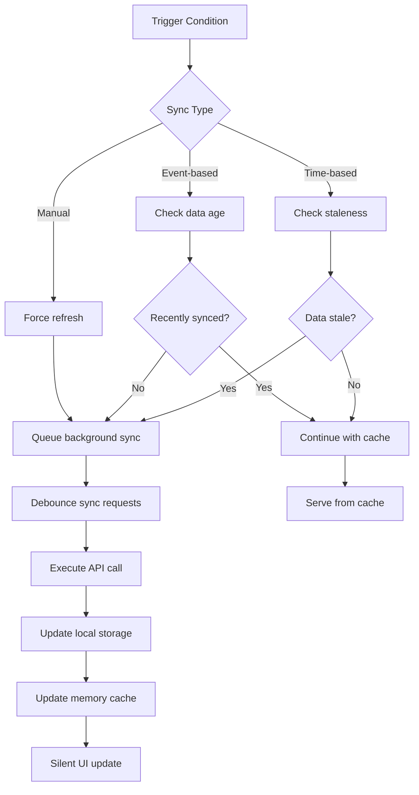
```mermaid
flowchart TD
    A[Trigger Condition] --> B{Sync Type}
    B -->|Time-based| C[Check staleness]
    B -->|Event-based| D[Check data age]
    B -->|Manual| E[Force refresh]
    
    C --> F{Data stale?}
    F -->|Yes| G[Queue background sync]
    F -->|No| H[Continue with cache]
    
    D --> I{Recently synced?}
    I -->|No| G
    I -->|Yes| H
    
    E --> G
    
    G --> J[Debounce sync requests]
    J --> K[Execute API call]
    K --> L[Update local storage]
    L --> M[Update memory cache]
    M --> N[Silent UI update]
    
    H --> O[Serve from cache]
```

### 2. Optimistic Updates

Immediate UI response with eventual consistency.

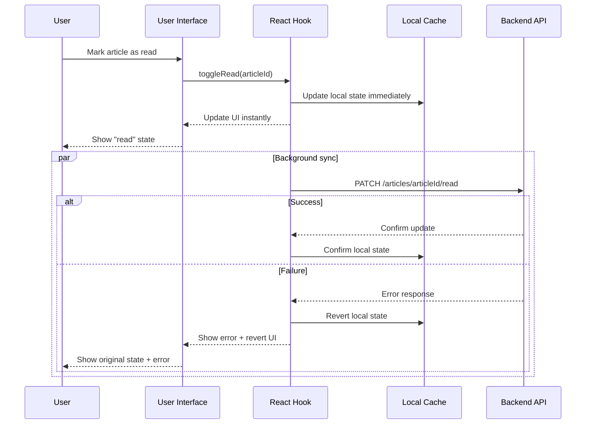
```mermaid
sequenceDiagram
    participant U as User
    participant UI as User Interface
    participant Hook as React Hook
    participant Cache as Local Cache
    participant API as Backend API
    
    U->>UI: Mark article as read
    UI->>Hook: toggleRead(articleId)
    Hook->>Cache: Update local state immediately
    Hook-->>UI: Update UI instantly
    UI-->>U: Show "read" state
    
    par Background sync
        Hook->>API: PATCH /articles/articleId/read
        alt Success
            API-->>Hook: Confirm update
            Hook->>Cache: Confirm local state
        else Failure
            API-->>Hook: Error response
            Hook->>Cache: Revert local state
            Hook-->>UI: Show error + revert UI
            UI-->>U: Show original state + error
        end
    end
```

### 3. Conflict Resolution

Handling conflicts between local and server state.

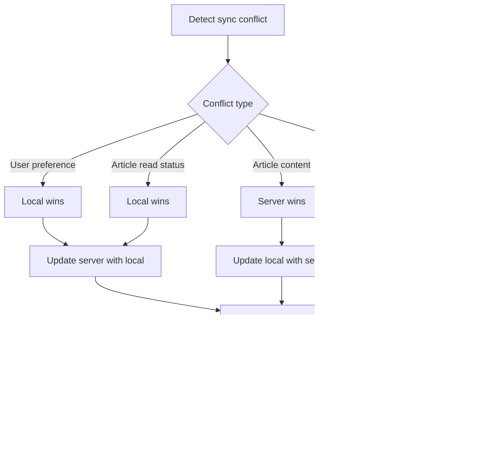
```mermaid
flowchart TD
    A[Detect sync conflict] --> B{Conflict type}
    B -->|User preference| C[Local wins]
    B -->|Article read status| D[Local wins]
    B -->|Article content| E[Server wins]
    B -->|Saved articles| F[Merge both]
    
    C --> G[Update server with local]
    D --> G
    E --> H[Update local with server]
    F --> I[Union of both sets]
    
    G --> J[Confirm sync success]
    H --> J
    I --> J
    
    J --> K[Update cache]
    K --> L[Silent UI update]
```

## 🚨 Error Handling Flows

### 1. Storage Quota Exceeded

Recovery from storage limitations.

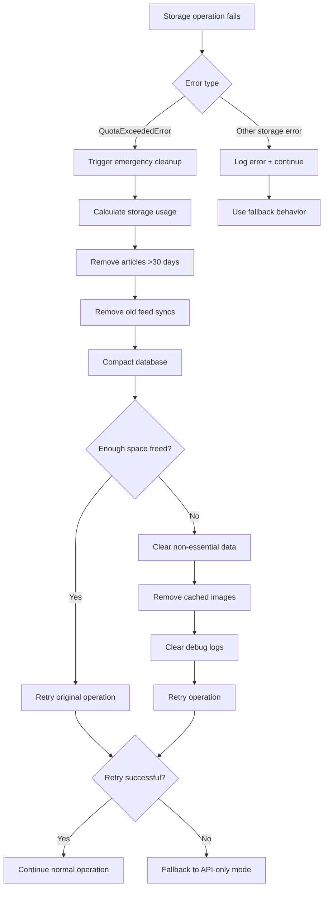
```mermaid
flowchart TD
    A[Storage operation fails] --> B{Error type}
    B -->|QuotaExceededError| C[Trigger emergency cleanup]
    B -->|Other storage error| D[Log error + continue]
    
    C --> E[Calculate storage usage]
    E --> F[Remove articles >30 days]
    F --> G[Remove old feed syncs]
    G --> H[Compact database]
    H --> I{Enough space freed?}
    
    I -->|Yes| J[Retry original operation]
    I -->|No| K[Clear non-essential data]
    
    K --> L[Remove cached images]
    L --> M[Clear debug logs]
    M --> N[Retry operation]
    
    J --> O{Retry successful?}
    N --> O
    O -->|Yes| P[Continue normal operation]
    O -->|No| Q[Fallback to API-only mode]
    
    D --> R[Use fallback behavior]
```

### 2. Network Failure Recovery

Graceful handling of network issues.

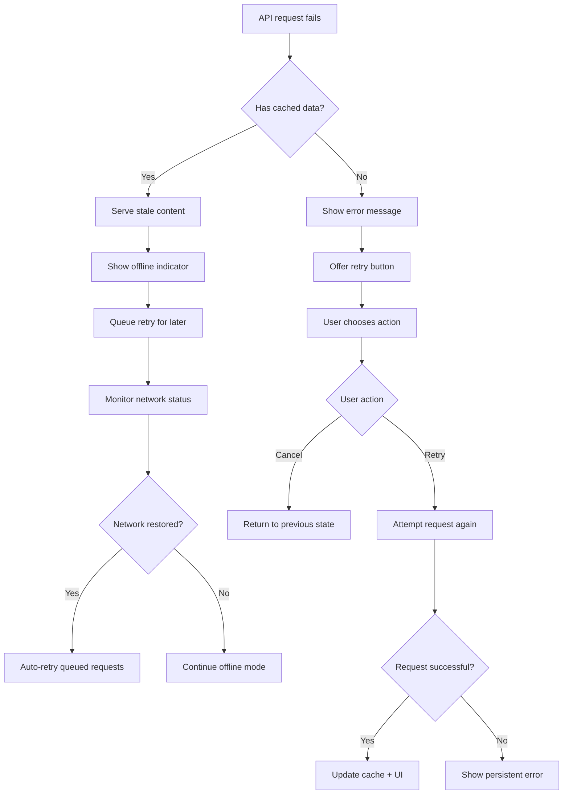
```mermaid
flowchart TD
    A[API request fails] --> B{Has cached data?}
    B -->|Yes| C[Serve stale content]
    B -->|No| D[Show error message]
    
    C --> E[Show offline indicator]
    E --> F[Queue retry for later]
    
    D --> G[Offer retry button]
    G --> H[User chooses action]
    H --> I{User action}
    I -->|Retry| J[Attempt request again]
    I -->|Cancel| K[Return to previous state]
    
    F --> L[Monitor network status]
    L --> M{Network restored?}
    M -->|Yes| N[Auto-retry queued requests]
    M -->|No| O[Continue offline mode]
    
    J --> P{Request successful?}
    P -->|Yes| Q[Update cache + UI]
    P -->|No| R[Show persistent error]
```

### 3. Data Corruption Recovery

Handling corrupted local data.

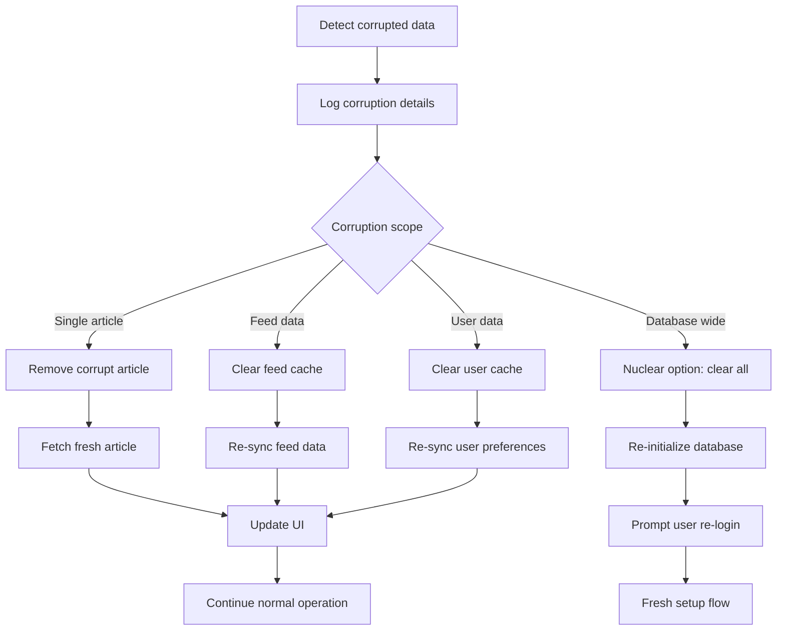
```mermaid
flowchart TD
    A[Detect corrupted data] --> B[Log corruption details]
    B --> C{Corruption scope}
    C -->|Single article| D[Remove corrupt article]
    C -->|Feed data| E[Clear feed cache]
    C -->|User data| F[Clear user cache]
    C -->|Database wide| G[Nuclear option: clear all]
    
    D --> H[Fetch fresh article]
    E --> I[Re-sync feed data]
    F --> J[Re-sync user preferences]
    G --> K[Re-initialize database]
    
    H --> L[Update UI]
    I --> L
    J --> L
    K --> M[Prompt user re-login]
    M --> N[Fresh setup flow]
    
    L --> O[Continue normal operation]
```

## 📈 Performance Optimization Flows

### 1. Preloading Strategy

Anticipatory loading for better UX.

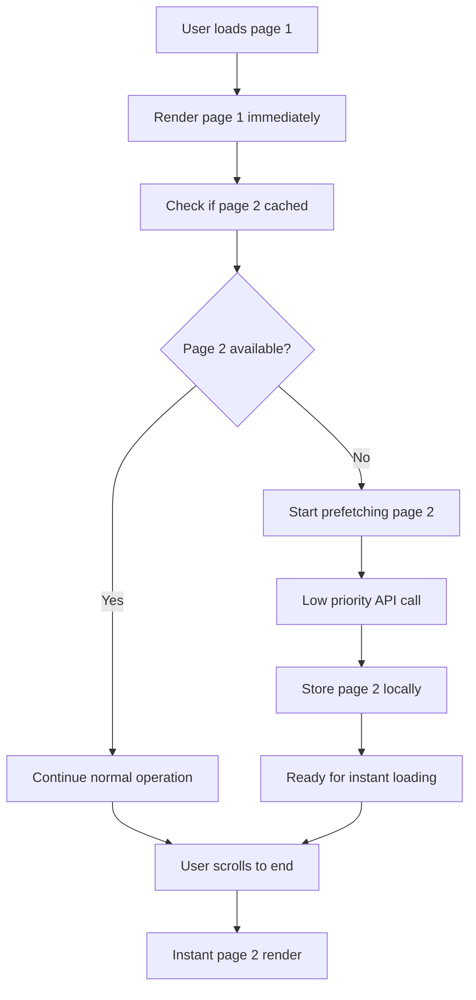
```mermaid
flowchart TD
    A[User loads page 1] --> B[Render page 1 immediately]
    B --> C[Check if page 2 cached]
    C --> D{Page 2 available?}
    D -->|No| E[Start prefetching page 2]
    D -->|Yes| F[Continue normal operation]
    
    E --> G[Low priority API call]
    G --> H[Store page 2 locally]
    H --> I[Ready for instant loading]
    
    F --> J[User scrolls to end]
    I --> J
    J --> K[Instant page 2 render]
```

### 2. Memory Management

Proactive cleanup to prevent memory leaks.

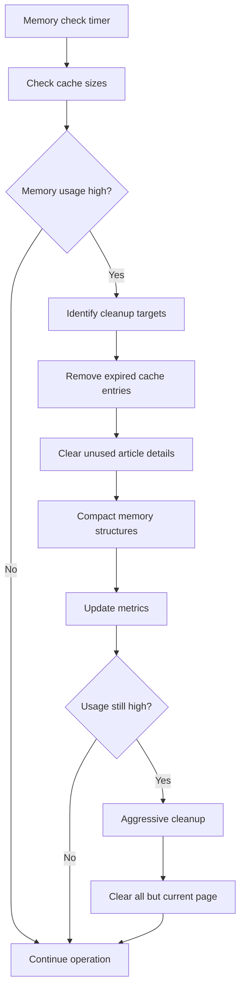
```mermaid
flowchart TD
    A[Memory check timer] --> B[Check cache sizes]
    B --> C{Memory usage high?}
    C -->|No| D[Continue operation]
    C -->|Yes| E[Identify cleanup targets]
    
    E --> F[Remove expired cache entries]
    F --> G[Clear unused article details]
    G --> H[Compact memory structures]
    H --> I[Update metrics]
    I --> J{Usage still high?}
    
    J -->|No| D
    J -->|Yes| K[Aggressive cleanup]
    K --> L[Clear all but current page]
    L --> D
```

This comprehensive flow documentation ensures developers understand how data moves through the system and how users interact with the local-first architecture. 